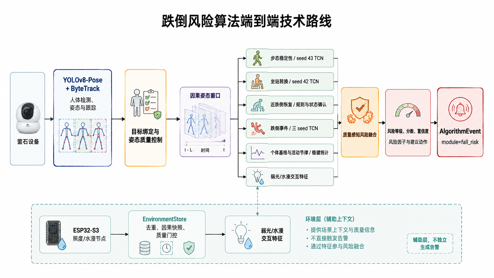
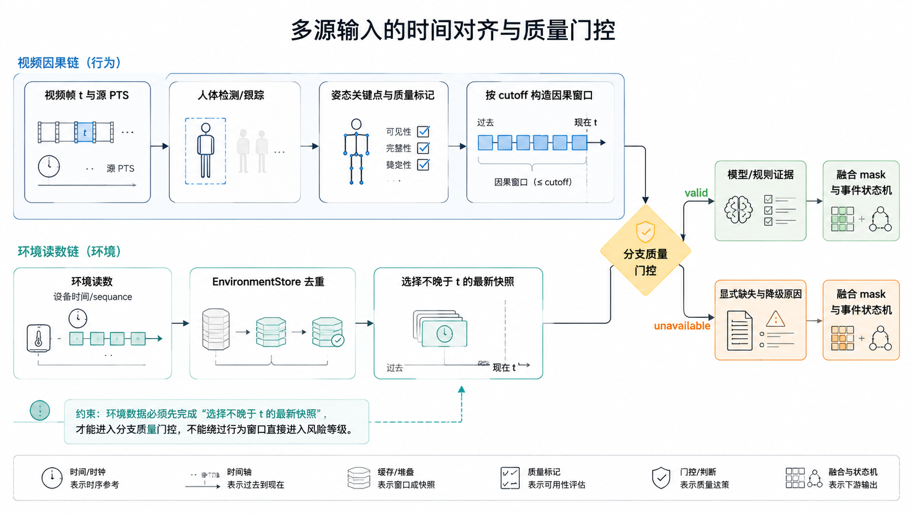
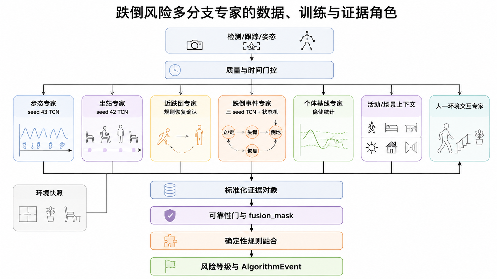
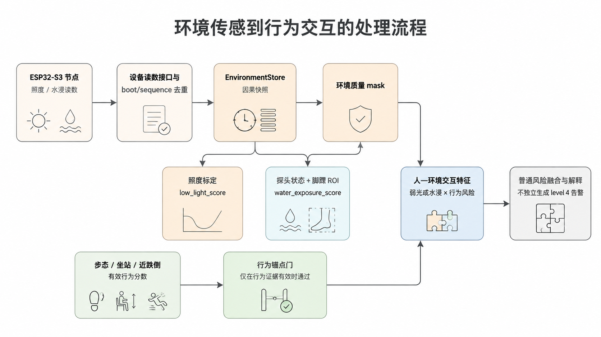
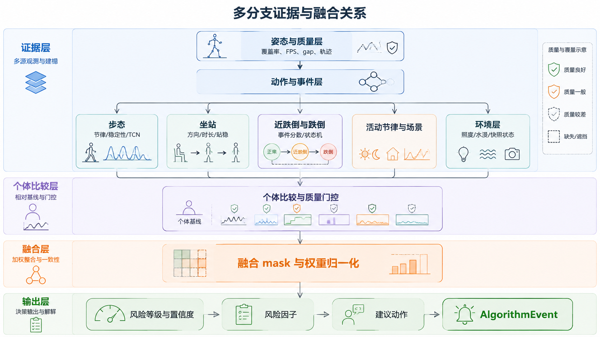
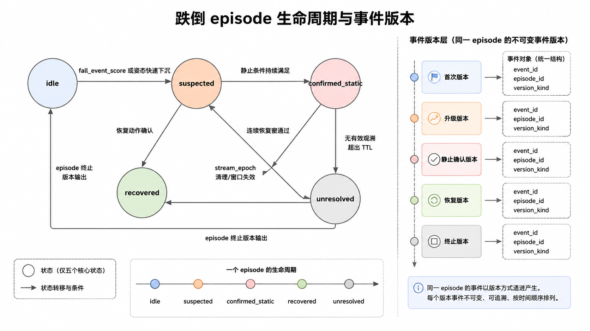
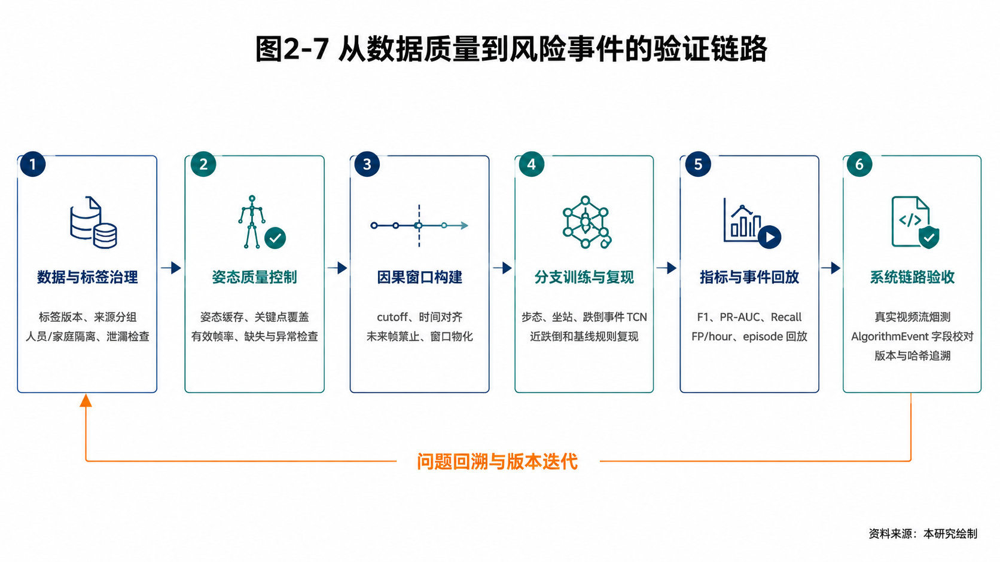

# 第2章 跌倒风险预警算法

## 摘要

针对居家养老场景中跌倒事件突发、前置征兆分散、视频姿态易受遮挡和环境变化影响等问题，本研究构建了一套面向连续视频流的多层时序跌倒风险预警算法。系统以 YOLOv8-Pose 和 ByteTrack 完成人体检测、17 点姿态估计与轨迹维护，在统一的关键点质量控制和因果时间窗上，分别提取步态稳定性、坐站转换、近跌倒恢复、跌倒事件、个体行为基线、活动节律和环境暴露证据，再由跌倒模块内部的质量感知融合器生成风险等级、连续分数、置信度、风险因子、证据窗口和建议动作。正式运行版本固定采用步态 seed 43 TCN、坐站 seed 42 TCN 和跌倒事件 seed 42/43/44 三 seed TCN 集成作为模型主评分，近跌倒、个体基线与最终风险融合采用可解释的规则和稳健统计实现；ESP32-S3、TSL2591 照度传感器和水浸探头已完整接入实时服务，环境读数经过设备身份、时间一致性、照度标定和水浸 ROI 门控后，与行为信号形成弱光/水浸交互特征。授权 HTTPS-FLV 视频流完成 120 s 算法端烟测，验证了从真实视频流到风险事件输出的端到端链路。该方案将“跌倒发生后的识别”扩展为“功能变化—近跌倒—跌倒事件—环境交互”的连续风险建模，并以因果时序、质量门控、个体化比较和版本化制品形成适合比赛演示与工程复现的完整算法体系。

## 2.1 研究目标与总体框架

### 2.1.1 问题定义

传统视频跌倒检测通常把任务定义为“当前片段是否包含跌倒动作”。但在真实居家环境中，跌倒风险往往先表现为步态节律改变、起身困难、短时失衡、扶物恢复或活动规律偏移。因此，本研究将任务定义为连续视频条件下的分层风险感知：算法在当前时刻 `t` 只读取已经到达的观测，判断目标老人是否出现功能变化、近跌倒、跌倒或跌倒后静止，并结合个人历史和环境暴露生成风险事件。

设姿态观测序列为：

$$
X_{1:t}=\{x_1,x_2,\ldots,x_t\},\qquad
x_t=(p_t,q_t,b_t,\Delta t_t),
$$

其中 `p_t` 为 17 个关键点坐标，`q_t` 为关键点置信度和质量标记，`b_t` 为人体框与轨迹信息，`Delta t_t` 为相邻源帧的真实时间间隔。所有时序窗口满足 `future_observation_count=0`，从机制上避免未来帧泄漏。

输出为 `module=fall_risk` 的 `AlgorithmEvent`，包含：

- `risk_level`：0—4 级风险等级；
- `risk_score`：0—1 连续风险分数；
- `confidence`：由质量覆盖和有效分支共同计算的置信度；
- `trigger_event`：步态、坐站、近跌倒、跌倒或长静止等触发类型；
- `risk_factors`：可解释的行为、个人、场景和环境因素；
- `recommended_action` 与 `evidence_window`：建议动作及其对应的时间证据。

### 2.1.2 设计原则

1. **前置风险与紧急事件并重。** 步态、坐站和近跌倒用于提前发现风险变化，跌倒事件和长时间静止用于安全覆盖。
2. **分任务、分时间尺度建模。** 每个分支保留自己的窗口、特征和事件语义，避免把动作、功能和环境信号粗暴拼接。
3. **因果在线推理。** 当前评分只依赖当前及历史观测，适用于直播流逐帧更新。
4. **质量信息显式传播。** 关键点质量、轨迹连续性、帧间 gap 和环境快照时效参与分支门控与融合。
5. **模型与规则协同。** 模型承担主评分，规则承担近跌倒、个体基线、融合解释和异常降级，保证链路连续可用。
6. **环境信号与行为信号协同。** 照度和水浸读数不绕过行为证据单独产生告警，而是与有效行为锚点形成交互风险。

### 2.1.3 总体技术路线

**图2-1  跌倒风险算法端到端技术路线**

## 2.2 感知底座与数据处理

### 2.2.1 人体检测、姿态估计与跟踪

视觉主链采用 YOLOv8-Pose 同时完成检测和 17 点姿态估计，以 ByteTrack 关联相邻帧中的人体框。系统保留 `track_id`、人体框、中心点、轨迹置信度、源 PTS 和流 `stream_epoch`。`track_id` 是单路视频内的临时轨迹，`person_id` 是业务侧人员标识；两者分离可以避免重连或多人同框时错误继承历史。

目标管理显式维护 `unbound`、`bound`、`ambiguous` 和 `lost` 状态。绑定依据人体框连续性、位置变化和轨迹置信度共同决定；当出现多人歧义时，系统拒绝将最大框直接视为目标；当目标超过丢失时限重新出现时，重新建立窗口。该机制把身份不确定性隔离在感知层，不让错误轨迹污染后续模型。

### 2.2.2 关键点质量控制

每帧姿态首先完成坐标规范化、骨骼尺度归一化和关键点置信度筛选。对关键点 `j` 的质量定义为：

$$
q_{t,j}=\mathbf{1}(c_{t,j}\geq\tau_c)\cdot
\mathbf{1}(\lVert p_{t,j}-p_{t-1,j}\rVert\leq\tau_v),
$$

其中 `c_{t,j}` 为检测置信度，`tau_c` 为置信度门槛，`tau_v` 为相邻帧跳变门槛。短缺失允许在时间间隔约束内插值，连续缺失、异常跳变、核心关节缺失和超时 gap 则保留为无效，不以伪造坐标补齐。

姿态质量汇总为窗口级指标：

$$
Q_w=\frac{1}{T}\sum_{t=1}^{T}
\frac{1}{|J|}\sum_{j\in J}q_{t,j},
$$

并同步记录核心关键点覆盖、有效帧率、最大 gap、窗口覆盖、人体尺度和插值比例。质量字段参与模型门控、置信度和解释，但不直接提升风险等级。

### 2.2.3 时间窗口与多尺度特征

系统使用源 PTS 构造因果窗口，单调时钟用于接收等待、推理节流、帧龄和停止预算。主要窗口设置如下：

| 分支 | 窗口与采样 | 主要特征 |
|---|---|---|
| 步态 | 4 FPS、16 帧、约 4 s | 步速、节律、停顿、踝部摆动、左右不对称、转身稳定性 |
| 坐站 | 4 FPS 因果事件窗 | 躯干角、髋部高度、膝髋相对运动、转换时长、站稳时间 |
| 近跌倒 | 5 帧以上短窗及恢复窗 | 快速下沉、躯干偏转、急停、扶物 proxy、恢复确认 |
| 跌倒事件 | `[32,17,20]` 因果 TCN 窗口 | 位置、速度、加速度、骨骼关系、尺度、质量和时间通道 |
| 个体基线 | 日/小时统计周期 | 步态、坐站、近跌倒频率、活动量和场景分布偏离 |
| 环境快照 | 不晚于视频帧的最新读数 | 照度、探头状态、快照年龄、设备状态、ROI 连续命中 |

### 2.2.4 多源数据来源、监督目标与算法角色

跌倒风险算法同时使用公开视频、自采居家动作视频、姿态缓存、场景元数据、个人连续特征和环境节点读数。不同来源承担不同监督角色：公开视频提供动作和事件变化，自采视频提供居家动作与困难负例，姿态缓存提供统一的时序输入，个人记录提供相对本人变化，环境节点提供行为发生时的照度和水浸上下文。

**表2-1  跌倒风险多源数据来源、监督目标与算法角色**

| 数据或输入域 | 样本/记录单位 | 监督目标或计算任务 | 运行时输入 | 算法角色 |
|---|---|---|---|---|
| LE2I/IMViA | 居家视频、跌倒事件区间 | 跌倒事件定位和长静止识别 | 视频帧、源 FPS、PTS | 跌倒事件主训练与回放 |
| Fall Detection 2017 | 动作视频与困难背景 | 跌倒、正常活动和快速下沉区分 | 视频帧、姿态窗口 | 事件与姿态链路增强 |
| UR Fall、CaucaFall | 多视角跌倒视频 | 跌倒方向、倒地状态和视角变化 | 视频帧、事件标签 | 跨场景姿态与事件训练 |
| NTU RGB+D | 受试者级动作视频 | 跌倒与近跌倒动作监督 | 视频、动作区间 | 事件类别和困难负例 |
| SCF_MVP_V1 | 自采居家动作与坐站事件 | 坐站、近跌倒和居家困难负例 | 视频、人工区间 | 居家动作增强与演示回放 |
| 姿态缓存 | 6,512 个 eligible RGB 视频、674,889 源帧 | 关键点提取、质量统计和时序建模 | `pose` JSONL/内存窗口 | 共享感知底座 |
| 场景元数据 | `scene_region` 与摄像头配置 | 场景风险先验 | `bathroom`、`stairs`、`living_room` 等 | 融合上下文与解释 |
| 个人连续特征 | `person_id` 的日/小时周期 | 基线偏离与活动节律 | 周期特征和质量字段 | 个体化比较 |
| 环境节点 | ESP32-S3、TSL2591、水浸探头 | 低照度、水浸与行为交互 | 设备读数、序列和状态 | 人—环境交互增强 |

公开视频、人工标签和个人连续记录在进入算法前均转换为统一的时间、身份和质量字段。数据源标识仅用于分组和追溯，不直接作为风险特征，避免模型学习到文件名、场景名称或数据来源捷径。

### 2.2.5 基础字段、派生特征与使用位置

**表2-2  基础字段、派生特征与算法用途**

| 证据域 | 基础字段 | 派生特征 | 使用位置 |
|---|---|---|---|
| 检测跟踪 | `frame_id`、`track_id`、人体框、中心、轨迹置信度、PTS | 轨迹连续性、速度、丢失时长、尺度 | 目标绑定和窗口构建 |
| 姿态质量 | 17 点坐标、关键点分数、`valid`、插值来源、跳变标记 | 核心关节覆盖、有效帧率、最大 gap、窗口覆盖 | 所有时序分支门控 |
| 步态 | 踝、膝、髋、躯干位置和运动 | 步速、步幅 proxy、节律、停顿、不对称、转身 | 步态 TCN 与解释 |
| 坐站 | 躯干角、髋部高度、膝髋夹角、支撑线索 | 起身方向、转换时长、失败尝试、站稳时间 | 坐站 TCN 与状态机 |
| 近跌倒/跌倒 | 重心、躯干角、下降速度、运动分、静止时长 | 失衡峰值、恢复状态、事件分数、episode | 事件检测和强触发 |
| 个体活动 | `person_id`、周期时间、活动量、区域计数 | 中位数、MAD、近期/历史偏离、昼夜节律 | 个体基线和活动专家 |
| 场景上下文 | `scene_region`、相机配置 | 场景先验、区域风险因子 | 规则融合 |
| 环境快照 | `device_id`、`boot_id`、`sequence`、照度、探头状态 | `low_light_score`、`water_exposure_score`、快照年龄 | 环境质量门控与交互 |

### 2.2.6 时间锚点、质量门限与数据分区

所有输入同时受“观测发生时间”和“系统可知时间”约束。视频姿态窗口以源 PTS 为时间锚点，环境读数只选择不晚于视频帧的最新快照，个人基线只读取已经完成的历史周期。训练与评价按照人员、家庭、原视频和保守来源组分组，防止同一主体或同一片段在不同分区重复出现。

**表2-3  跌倒风险关键时间窗与质量门控**

| 对象 | 时间/质量口径 | 输出权限 |
|---|---|---|
| 实时内存窗口 | 最近 10 s，按分支 cutoff 取用 | 支持步态、坐站、近跌倒和跌倒状态 |
| 步态窗口 | 4 FPS、16 帧；有效比例和核心覆盖达标 | 进入 seed 43 TCN 或规则步态分 |
| 坐站窗口 | 连续事件窗；有效 FPS 4.0、最大 gap 1.0 s | 进入 seed 42 TCN 或规则状态机 |
| 近跌倒窗口 | 至少 5 帧；有效比例和核心覆盖达标 | 生成候选并等待恢复确认 |
| 跌倒事件窗口 | 观察窗 1 s；静止累计和恢复窗按事件状态机推进 | 进入三 seed TCN 与强触发状态 |
| 个体周期 | 日/小时周期完成并通过质量统计 | 写入个人比较和活动节律 |
| 环境快照 | 设备绑定、序列合法、时钟同步、快照新鲜、ROI 有效 | 进入环境交互特征 |

**图2-2  多源输入的时间对齐与质量门控**

图2-2强调时间对齐和质量门控是所有分支共享的前置层，环境数据不会绕过行为窗口直接进入风险等级。

## 2.3 核心算法原理

### 2.3.1 步态稳定性分析

步态风险不是用单帧姿态判断，而是分析一个完整的短时运动周期。系统先以骨盆中心作为人体平移参考，将踝、膝、髋和躯干坐标归一化：

$$
\tilde p_{t,j}=\frac{p_{t,j}-p_{t,hip}}{h_t+\epsilon},
$$

其中 `h_t` 为肩髋尺度。随后计算速度、加速度、步态周期 proxy、左右对称性和转身稳定性：

$$
v_{t,j}=\frac{\tilde p_{t,j}-\tilde p_{t-1,j}}{\Delta t_t},\qquad
a_{t,j}=\frac{v_{t,j}-v_{t-1,j}}{\Delta t_t}.
$$

TCN 以多层一维因果卷积提取不同时间尺度的局部模式。第 `l` 层的感受野由膨胀率 `d_l` 控制：

$$
z_t^{(l)}=\sigma\left(\sum_{k=0}^{K-1}W_k^{(l)}z_{t-d_lk}^{(l-1)}+b^{(l)}\right),
$$

通过 `d_l=1,2,4,8` 的层级结构，在不引入未来信息的前提下同时观察短时摆动和较长节律。正式版本使用 seed 43 TCN；规则特征并行生成 `fallback_score`、`score_source` 和步态风险因子。

### 2.3.2 坐站转换能力分析

坐站转换被拆成“动作方向—转换过程—站稳结果”三个阶段。躯干角可写为：

$$
\theta_t=\arctan2(y_{shoulder}-y_{hip},x_{shoulder}-x_{hip}),
$$

髋部垂直位移、躯干角速度和膝髋夹角共同描述身体从坐姿到站姿的变化。系统首先检测连续方向变化，再以起始点、转换点和站稳点构成事件；失败尝试、多次摆动和站稳时间增加会提高 `sit_stand_risk_score`。seed 42 TCN 在最新 causal cutoff 上完成主评分，规则状态机提供事件定位、解释和异常降级。

### 2.3.3 近跌倒恢复检测

近跌倒的核心是“出现明显失衡，但最终恢复站立”。系统以躯干角变化、重心下降速度、横向偏移、急停和脚踝支撑变化生成候选：

$$
u_t=\alpha|\dot\theta_t|+\beta|\dot y_{com,t}|+
\gamma|\Delta x_{com,t}|+\delta r_{support,t},
$$

当 `u_t` 超过候选门槛后，状态机继续检查恢复窗内的姿态回正、运动分回升和轨迹连续性，只有满足持续性约束才形成近跌倒事件。该方法将正常转身、主动下蹲和可控坐下与真正的失衡恢复区分开来，并输出峰值、恢复时间、证据关键点和拒绝原因。

### 2.3.4 跌倒事件与长时间静止

跌倒事件分支采用 seed 42/43/44 三个 TCN checkpoint 的等权概率集成：

$$
P_{fall}(t)=\frac{1}{3}\sum_{k\in\{42,43,44\}}P_{fall}^{(k)}(t).
$$

当跌倒事件分数或长静止分数达到强触发阈值，状态机由 `idle` 转入 `suspected`；躯干姿态、运动分和持续静止条件满足后转入 `confirmed_static`；检测到连续恢复后转入 `recovered`，流超时或事件无法闭合时转入 `unresolved`。每次状态跃迁均生成稳定 `episode_id` 和不可变 `event_id`，保证事件首报、升级、恢复和终止可追溯。

### 2.3.5 个体行为基线与活动节律

个体基线用本人历史而非群体均值作为参照。对指标 `f` 的近期值 `x_f`，以历史中位数 `m_f` 和 MAD 估计稳健偏离：

$$
z_f=\frac{|x_f-m_f|}{1.4826\cdot MAD_f+\epsilon},
\qquad
b_f=1-e^{-z_f}.
$$

步态、坐站、近跌倒频率和夜间活动分别计算 `b_f`，再按有效周期和质量加权得到 `baseline_deviation_score`。高风险事件和低质量窗口不写入正常基线，保证个人参照不会被异常样本污染。活动节律以日/小时统计描述活动量变化和区域分布变化，为风险融合提供长期上下文。

### 2.3.6 环境因素与人—环境交互

环境模块已完整接入视频服务和风险融合链路。ESP32-S3 通过环境接口上传照度与水浸观测，EnvironmentStore 负责去重、乱序处理、设备 boot/sequence 管理和有界缓存；视频帧到达时只读取不晚于该帧时间的最新快照。

照度根据现场标定的正常照度 `L_n` 与严重低照度 `L_s` 计算：

$$
e_{light}=\operatorname{clip}\left(
\frac{L_n-L}{L_n-L_s},0,1\right).
$$

水浸风险由探头状态和人体脚踝在探头 ROI 内的连续命中共同确定：

$$
e_{water}=r_{probe}\cdot
\operatorname{clip}\left(\frac{1}{N}\sum_{t=1}^{N}
\mathbf{1}(p_{ankle,t}\in ROI),0,1\right).
$$

环境交互只在行为锚点有效时形成：

$$
I_{env}=E_{env}\cdot\max(s_{gait},s_{sit\_stand},s_{near\_fall}),
$$

其中 `E_env` 为照度或水浸暴露分数。由此可以表达“弱光下步态不稳”“水浸区域附近出现近跌倒”等组合风险，而不会把低照度或探头触发直接误判为跌倒。

### 2.3.7 多分支专家体系与证据角色

跌倒风险中的“专家”是对一组具有独立时间窗、特征和输出语义的分支的统称，不是另一个黑盒总模型。各专家先完成领域内的分数、事件或统计证据，再由编排层统一决定证据权限。这样可以使模型主评分、规则解释、个人基线和环境上下文各司其职。

**图2-3  跌倒风险多分支专家的数据、训练与证据角色**

### 2.3.8 专家训练与运行协议

**表2-4  跌倒风险专家的训练与运行协议**

| 专家 | 模型/规则 | 主输出 | 运行质量条件 | 解释字段 |
|---|---|---|---|---|
| 步态稳定性 | seed 43 TCN；规则并行 | `gait_risk_score` | 4 FPS、16 帧、核心覆盖和 gap 通过 | 节律、停顿、左右不对称、score source |
| 坐站转换 | seed 42 TCN；规则状态机 | `sit_stand_risk_score`、事件方向 | 连续事件窗、有效 FPS、转换边界完整 | 起身时长、失败尝试、站稳时间 |
| 近跌倒恢复 | 姿态规则与恢复确认 | `near_fall_event_score`、恢复状态 | 候选峰值、持续性和恢复窗通过 | 峰值、恢复时间、支撑 proxy |
| 跌倒事件 | 三 seed TCN；episode 状态机 | `fall_event_score`、`long_static_score` | 事件窗、目标轨迹和静止条件通过 | 触发类型、状态跃迁、episode |
| 个体基线 | 中位数、MAD、周期统计 | `baseline_deviation_score` | 历史周期、个人 ID、质量统计有效 | 历史覆盖、偏离方向、冷启动 |
| 活动节律 | 日/小时统计规则 | `activity_rhythm_score` | 周期完整、活动统计质量通过 | 活动量、昼夜分布、区域变化 |
| 场景上下文 | 配置映射 | `scene_risk_score` | `scene_region` 绑定配置 | 场景名称、先验值 |
| 环境交互 | 照度标定、水浸 ROI、交互公式 | `environment_interaction_score` | 设备、时间、标定、ROI 门控通过 | 照度、探头、快照龄、环境 mask |

### 2.3.9 专家输出的统一字段

每条专家结果都包含四组信息。第一组是“结果”：分数、方向、事件类型和状态；第二组是“质量”：有效帧数、窗口覆盖、FPS、gap、关键点覆盖或环境快照状态；第三组是“来源”：模型版本、seed、规则版本和 `score_source`；第四组是“解释”：贡献特征、触发时间、恢复时间和降级原因。

统一字段使编排层可以在不读取分支内部实现的情况下完成可靠性判断，也使演示界面能够从同一事件中同时展示“分数是多少”“为什么得到这个分数”和“这段证据来自哪个时间窗”。

## 2.4 环境传感与行为交互模块

环境模块是跌倒风险链路的完整组成部分，由边缘节点、服务接入、快照存储、质量门控、行为锚定和风险融合六个层次组成。它不是把照度或水浸数值直接拼到姿态向量，而是先保证读数的身份、顺序、时间和空间语义，再与已经通过视觉质量门的行为证据计算交互项。

### 2.4.1 设备接入与数据契约

ESP32-S3 节点通过环境读数接口上报 `device_id`、`boot_id`、`sequence`、设备时间、服务接收时间、时钟状态、照度值和探头状态。`device_id + boot_id + sequence` 构成设备读数的幂等键；同一键的相同载荷重复上报不重复入库，同一键的冲突载荷保留冲突状态并拒绝覆盖。设备重启由 `boot_id` 变化显式表示，序列号回退不会被当作新数据。

环境服务在进程内维护有界 latest-snapshot 缓存，并将接收时间、设备时间、快照年龄和设备绑定状态写入诊断。视频帧到达时，查询只允许返回不晚于视频 PTS 的读数；未来读数、过期读数、设备故障和绑定不一致均形成结构化质量结果，避免环境数据与视频行为错位。

**表2-5  环境读数的接口字段与处理规则**

| 字段 | 语义 | 处理规则 |
|---|---|---|
| `device_id` | 环境节点身份 | 必须与摄像头会话绑定 |
| `boot_id` | 节点启动批次 | 变化时重置 sequence 连续性 |
| `sequence` | 节点单调序列 | 重复幂等、回退拒绝、冲突拒绝 |
| `device_ts` | 节点采样时间 | 与服务时间共同判断因果性 |
| `received_mono` | 服务接收单调时间 | 用于快照年龄和延迟统计 |
| `lux` | TSL2591 照度读数 | 按机位标定映射到 0—1 |
| `water_state` | 探头水浸状态 | 与脚踝 ROI 连续命中联合使用 |
| `binding_status` | 节点与摄像头绑定状态 | 绑定通过后才开放环境 mask |

### 2.4.2 照度标定与弱光特征

不同摄像头、房间和安装高度的正常照度范围不同，因此照度不直接使用固定的全局阈值。对每个机位记录正常照度 (L_n)、严重低照度 (L_s) 和标定版本，使用分段截断函数计算：

$$
e_{light}=\operatorname{clip}\left(
\frac{L_n-L}{L_n-L_s},0,1\right).
$$

当 (L\geq L_n) 时，`low_light_score=0`；当 (L\leq L_s) 时，分数达到 1；中间区域保留连续变化。标定参数随摄像头配置保存，事件中记录 `calibration_id`，保证同一机位的回放结果可以复现。

### 2.4.3 水浸探头与空间 ROI

水浸探头只能说明探头附近存在水，不等于老人已经处于危险位置。系统首先检查探头状态，再将主目标脚踝关键点投影到归一化 ROI，计算连续窗口内的命中比例：

$$
r_{roi}=\frac{1}{N}\sum_{t=1}^{N}
\mathbf{1}(p_{ankle,t}\in ROI),\qquad
e_{water}=r_{probe}\cdot r_{roi}.
$$

ROI 版本、探头位置和连续命中帧数同时写入环境证据。短时单点命中只形成观测记录，连续命中且行为分支有效时才形成 `water_exposure_near_person` 交互因子。

### 2.4.4 人—环境交互与安全权限

环境信号以行为风险为锚点，不独立覆盖视觉分支。设有效行为集合为步态、坐站和近跌倒，则：

$$
I_{env}(t)=E_{env}(t)\cdot
\max\{s_{gait}(t),s_{sit\_stand}(t),s_{near\_fall}(t)\}.
$$

环境交互可以形成“弱光下步态不稳”“弱光下起身后摆动增加”“水浸区域附近近跌倒”等风险因子。环境贡献仅进入普通融合分数和解释字段，跌倒事件/长静止强触发仍由独立事件分支控制。

### 2.4.5 环境模块运行状态与验证

环境模块内部设置 `capture`、`shadow` 和 `assist` 三种运行状态。`capture` 负责完整接收和质量记录，`shadow` 在不改变事件权限的情况下观测交互覆盖，`assist` 在行为门槛满足时将交互项纳入普通融合。三种状态共享同一设备契约、缓存和质量门控，状态切换写入事件元数据。

**图2-4  环境传感到行为交互的处理流程**

环境链路已完成设备字段、重复/冲突读数、乱序和重启、因果快照、照度标定、水浸 ROI、FeatureAssembler 集成和安全权限回归测试。

## 2.5 质量感知融合与事件输出

### 2.5.1 分支证据标准化

每个分支输出统一的证据对象：`status`、输入帧数、有效帧数、窗口覆盖、有效 FPS、最大 gap、分数、模型版本、耗时、风险因子和原因。分支状态采用 `valid`、`unavailable`、`inference_error` 三态；融合器只消费 `valid` 分数，其余状态保留在诊断字段中。

**图2-5  多分支证据与融合关系**

### 2.5.2 规则融合公式

普通风险分支的配置权重为：步态 0.22、坐站 0.18、近跌倒 0.28、个体基线 0.16、场景 0.08、活动节律 0.08。对有效分支按掩码归一化：

$$
S_{base}(t)=
\frac{\sum_i m_i(t)w_i s_i(t)}
{\sum_i m_i(t)w_i},
\quad m_i(t)\in\{0,1\}.
$$

环境交互作为行为相关的增强项：

$$
S(t)=\operatorname{clip}\left(S_{base}(t)+
\lambda I_{env}(t),0,1\right),
$$

其中 lambda 为环境交互权重，`I_env` 必须通过环境质量门控和行为锚点门槛。跌倒事件和长时间静止属于独立强触发分支，具有高于普通加权分数的安全权限。

### 2.5.3 风险等级与建议动作

| 等级 | 工程触发条件 | 主要语义 | 建议动作 |
|---:|---|---|---|
| 0 | `S < 0.25`，无强触发 | 当前窗口未见明显风险线索 | `record_only` |
| 1 | `S >= 0.25` | 轻度功能或环境交互变化 | `observe` |
| 2 | `S >= 0.45` | 多项轻度变化或一项明显变化 | `remind_user` |
| 3 | 近跌倒分数 `>= 0.70`，或 `S >= 0.65` | 高风险行为/事件线索 | `notify_guardian` |
| 4 | 跌倒事件或长静止分数 `>= 0.80` | 工程强触发，需要紧急处置链路 | `emergency_alert` |

`risk_score` 是当前融合强度，`risk_level` 是工程阈值映射，二者均不是医疗诊断概率。环境交互只能增强行为解释和普通风险分数，不能绕过状态机直接生成 level 4。

### 2.5.4 置信度与可解释性

置信度由有效分支覆盖、质量覆盖和模型状态共同决定：

$$
c(t)=\operatorname{clip}\left(
\eta_q Q(t)+\eta_m M(t)+\eta_e E(t),0,1\right),
$$

其中 `Q(t)` 表示姿态和时间质量，`M(t)` 表示模型分支可用覆盖，`E(t)` 表示环境快照有效性。每次输出都携带贡献最大的风险因子、对应分支分数、证据时间窗、模型/规则来源和 episode 状态，支持对“为何升高、何时形成、何时恢复”的逐字段解释。

### 2.5.5 证据节点与执行顺序

一次目标帧/目标窗的完整推理按固定顺序执行：

1. 校验设备、人员、场景、源时间和 `stream_epoch`。
2. 取得人体检测、目标轨迹、姿态质量和各分支因果窗口。
3. 逐分支判断 `valid`、`unavailable` 或 `inference_error`，登记输入帧数和质量原因。
4. 运行步态、坐站、近跌倒、跌倒事件、个体基线、活动节律和场景专家。
5. 读取环境因果快照，执行设备绑定、照度标定、水浸 ROI 和行为锚点门控。
6. 仅用有效普通分支计算融合分数，同时保留跌倒事件和长静止的独立强触发权限。
7. 更新 episode 状态机、事件节流、异步 outbox，并输出不可变事件版本。

该顺序将“专家生成证据”和“证据获得何种权限”分开。一个分支不可用时，不会由场景或环境数据补造姿态分数；一个分支分数较低时，也不会被质量字段直接改写为高风险。

### 2.5.6 可靠性门控与 `fusion_mask`

**表2-6  跌倒风险证据可靠性门条件与处理方式**

| 检查项 | 通过条件 | 处理结果 |
|---|---|---|
| 目标状态 | 主目标已绑定、轨迹连续、无多人歧义 | 开放行为分支权限 |
| 姿态质量 | 核心关键点覆盖、有效 FPS、最大 gap 达到分支门槛 | 允许模型或规则分数进入融合 |
| 模型状态 | checkpoint、输入 shape、任务契约和输出范围合法 | 使用主评分并记录 seed |
| 规则状态 | 规则输入字段齐全，状态机时间连续 | 作为解释或模型 fallback |
| 个人基线 | 周期完成、历史字段有效、异常窗口未写回 | 允许计算偏离分数 |
| 场景上下文 | `scene_region` 与配置存在 | 允许计入场景因子 |
| 环境快照 | 设备绑定、序列合法、快照新鲜、标定/ROI 有效 | 允许形成交互特征 |
| 时间一致性 | 当前窗口无未来帧，流 epoch 一致 | 允许推进状态和事件 |

`fusion_mask` 只记录当前可用的普通分支，缺失分支保持 `null` 分数和明确原因；跌倒事件与长静止以独立安全输入保留。这样可以区分“该分支未观察到风险”和“该分支没有可靠观测”两种完全不同的语义。

### 2.5.7 证据优先级、去重与分歧保留

普通风险分支允许加权融合，但同一类证据不能通过多个字段重复计票。例如，步态 TCN 分数和步态规则分数属于同一专家的模型/规则两种来源，运行时只选择一个进入主分数，另一个保留为对照和解释；跌倒事件分数和 episode 状态属于同一事件链路，状态机不再将两者当作两张独立概率票。

分歧不被静默平均。当历史基线正常而近期步态、坐站同时升高时，事件保留“近期新变化”原因；当场景风险较高但行为分支质量不足时，只保留场景上下文而不升级风险；当环境快照有效但行为锚点不足时，输出环境观测记录而不形成交互风险。分歧、抑制和被消费节点均写入诊断。

### 2.5.8 Episode 状态机与时间迟滞

风险等级表示当前观测，episode 表示一段连续风险过程。状态机的主要状态为 `idle`、`suspected`、`confirmed_static`、`recovered` 和 `unresolved`。状态边记录源 PTS、单调进入时间、峰值、最后有效观测、触发条件、恢复条件和清理原因。

**图2-6  跌倒 episode 生命周期与事件版本**

同一 episode 的首次、升级、静止确认、恢复和终止使用不同 `version_kind`；每个版本具有不可变 `event_id`，重试或显式重放复用原事件 ID，避免重复告警。

### 2.5.9 标准事件输出

**表2-7  `AlgorithmEvent` 跌倒事件字段组织**

| 字段组 | 字段 | 内容 |
|---|---|---|
| 身份与时间 | `module`、`device_id`、`person_id`、`event_time` | 固定为 `fall_risk`，关联设备、目标和源时间 |
| 风险结果 | `risk_level`、`risk_score`、`confidence` | 当前等级、融合分数和质量感知置信度 |
| 触发语义 | `trigger_event`、`lifecycle_state`、`version_kind` | 近跌倒、跌倒、长静止、恢复和 episode 版本 |
| 解释证据 | `risk_factors`、`evidence_window`、`branch_scores` | 分支贡献、起止时间、模型/规则来源 |
| 质量诊断 | `fusion_mask`、`quality`、`environment_mask` | 分支可用性、姿态质量和环境快照状态 |
| 追溯信息 | `event_id`、`episode_id`、`session_id`、`stream_epoch` | 事件幂等、会话边界和流 epoch |
| 动作建议 | `recommended_action` | `record_only`、`observe`、`remind_user`、`notify_guardian` 或 `emergency_alert` |

算法模块只输出标准事件和诊断字段，业务系统按 `module=fall_risk` 独立持久化和处置，不在本模块内实现家属端、社区后台或消息工单逻辑。

## 2.6 系统实现与运行环境

### 2.6.1 实时服务链路

视频服务采用有界 latest-frame 队列，队列满时丢弃最旧帧并记录计数；源 PTS 用于动作窗口，单调时钟用于接收等待、帧龄、推理节流和停止预算。每次成功打开视频流创建新的 `stream_epoch`，跟踪器、姿态窗口、风险状态机和采样诊断不跨 epoch 复用。

推理线程只负责不可变版本创建和异步入队，不执行 HTTP 等待。outbox 维护 `pending`、`retrying`、`delivered` 和 `failed` 状态，事件包含 `event_id`、`episode_id`、`session_id`、`stream_epoch`、`lifecycle_state` 和 `version_kind`。诊断接口返回阶段耗时、分支质量、目标状态和环境快照状态，不返回直播地址、token 或原始视频。

### 2.6.2 环境模块完整接入

环境服务包括 `EnvironmentReadingRequest`、EnvironmentStore、环境特征纯函数和 FeatureAssembler 集成。设备读数由 `device_id + boot_id + sequence` 唯一约束：相同载荷重复上报幂等，序列回退或同键不同载荷被拒绝；环境时间与服务单调时间共同用于因果快照选择。照度通道按摄像头位置标定，水浸通道使用探头状态和脚踝 ROI 连续命中，所有环境分支均输出质量字段和 `environment_mask`。

环境模块采用三种运行状态以服务基线回放、审计和辅助融合；三种状态共享同一套已接入的设备接口、缓存和质量门控：

| 状态 | 已实现行为 |
|---|---|
| 基线回放态 | 完成设备接入、读数校验和质量记录，基线回放时不将交互项计入评分 |
| `shadow` | 计算并记录环境特征，实时观察时间对齐和交互覆盖 |
| `assist` | 通过行为门槛后将交互特征纳入融合，保留强触发等级保护 |

基线回放态只控制环境特征在评分中的使用，不代表环境模块未接入；三种状态均保留设备身份、序列、时间和质量诊断，所有切换均写入事件元数据。

### 2.6.3 软件和硬件环境

| 类别 | 配置 |
|---|---|
| Conda 环境 | `eldercare-ai` |
| Python | 3.11.15 |
| 深度学习与视觉 | torch 2.12.1、ultralytics 8.4.78、opencv-python 4.13.0.92 |
| 数据与机器学习 | NumPy 2.4.6、pandas 3.0.3、scikit-learn 1.9.0、LightGBM 4.6.0 |
| 视频解码 | FFmpeg/ffprobe |
| 视觉模型 | `models/yolov8n-pose.pt` |
| 环境节点 | ESP32-S3、TSL2591 照度传感器、水浸探头 |
| 推理设备 | CPU，可兼容 GPU 部署 |

### 2.6.4 会话边界、队列与回调

实时服务使用有界 latest-frame 队列控制解码速率和推理速率之间的差异。队列满时丢弃最旧帧并记录 `dropped_frame_count`；不等待旧帧完成后再处理新帧。每次成功打开流时递增 `stream_epoch`，并清理跟踪器、姿态窗口、分支缓存、事件节流和采样状态，旧 epoch 已生成的事件不被新 epoch 覆盖。

普通 level-0 观测不触发回调；level 1—4 事件按 episode 和时间策略去重，升级立即生成新版本；`recovered` 和 `unresolved` 作为 episode 终止版本输出。异步 outbox 维护 `pending`、`retrying`、`delivered` 和 `failed`，推理线程不等待网络请求，停止时执行有界排空。

### 2.6.5 运行诊断与复现入口

运行诊断按“输入—感知—分支—融合—事件—投递”六个阶段记录耗时和质量。输入阶段记录源 PTS、接收 PTS、帧龄和丢帧计数；感知阶段记录检测人数、目标状态、关键点覆盖和跟踪连续性；分支阶段记录窗口长度、有效 FPS、模型 seed、规则来源和分数；融合阶段记录 `fusion_mask`、环境快照、贡献排序和风险等级；事件阶段记录 episode 状态和版本；投递阶段记录 outbox 状态和回调耗时。

所有脚本和测试通过项目 `eldercare-ai` Conda 环境运行。典型复现入口包括：

~~~bash
conda run -n eldercare-ai python -m pip show elderly-monitoring-algorithms
conda run -n eldercare-ai python -m pytest tests/test_fall_risk_release_freeze.py -q
conda run -n eldercare-ai python -m pytest -q
~~~

### 2.6.6 正式运行制品

**表2-8  跌倒风险正式运行制品与职责**

| 制品角色 | 正式配置 | 运行职责 |
|---|---|---|
| 感知主链 | YOLOv8-Pose + ByteTrack | 人体检测、姿态、轨迹和目标状态 |
| 步态模型 | pretrained seed 43 TCN | 输出步态主评分和节律证据 |
| 坐站模型 | seed 42 TCN | 输出坐站事件和功能变化证据 |
| 跌倒模型 | seed 42/43/44 三 seed TCN | 输出跌倒事件分数和强触发证据 |
| 近跌倒分支 | 姿态规则 + 恢复状态机 | 输出前置失衡与恢复证据 |
| 个体基线 | 中位数/MAD/活动周期统计 | 输出相对本人历史的偏离 |
| 环境模块 | ESP32-S3/照度/水浸完整接入 | 输出环境快照和人—环境交互 |
| 融合与事件 | fusion mask + 规则 + episode | 输出等级、分数、置信度和标准事件 |

## 2.7 实验设计与结果

### 2.7.1 数据与训练组织

训练数据由 LE2I/IMViA、Fall Detection 2017、UR Fall、CaucaFall、NTU RGB+D、Pre-VFallp、TOAGA、SCF_MVP_V1 和整理后的公开视频组成。系统按人员、家庭、原视频和保守来源组进行分组，统一 split 覆盖 19,263 条标签、6,666 个资产和 187 个泄漏保护组，跨分区泄漏为 0。跌倒连续训练形成 7,701 条监督和 7,504 个 `[32,17,20]` 因果窗口。

姿态缓存统一使用 YOLOv8-Pose、ByteTrack、CPU 和同一质量契约，8 个批次覆盖 6,512 个 eligible RGB 视频、674,889 源帧。SCF 自采视频作为居家动作增强数据进入坐站、跌倒和近跌倒训练链，另行保留来源和主体字段。

**表2-9  姿态缓存批次与质量统计**

| 数据批次 | 视频数 | 源帧数 | 检测帧覆盖率 | 有效关键点率 | 下肢有效率 | 步态可用率 |
|---|---:|---:|---:|---:|---:|---:|
| LE2I/IMViA | 184 | 74,375 | 89.32% | 83.50% | 89.46% | 87.76% |
| CaucaFall | 100 | 19,877 | 89.10% | 90.98% | 98.44% | 98.13% |
| NTU RGB+D | 3,914 | 296,511 | 99.87% | 94.08% | 97.70% | 96.94% |
| Fall Detection 2017 | 2,012 | 113,651 | 96.15% | 90.68% | 96.15% | 94.47% |
| Fall TikTok | 66 | 10,945 | 88.46% | 81.29% | 91.00% | 88.74% |
| Pre-VFallp | 108 | 84,089 | 98.68% | 98.06% | 99.97% | 100.00% |
| TOAGA | 28 | 60,510 | 90.74% | 84.08% | 99.61% | 99.43% |
| UR Fall | 100 | 14,931 | 82.89% | 89.03% | 95.00% | 93.62% |

### 2.7.2 标签、训练窗口与评价指标

跌倒事件和近跌倒事件使用独立事件协议，坐站使用连续流事件协议，步态使用窗口分类协议。所有训练输入在物化时记录来源、主体组、窗口起止、cutoff、输入 shape 和 `future_observation_count`。模型输出采用任务匹配的指标：步态报告 F1 和 walking-gate F1，坐站报告 Event F1、Recall 和误报小时数，跌倒事件报告 F1、PR-AUC 和 episode 结果，环境模块报告契约、质量和交互回归结果。

**表2-10  正式运行分支的可复核结果**

| 分支 | 正式运行配置 | 评价结果 | 工程作用 |
|---|---|---|---|
| 步态稳定性 | seed 43 TCN + 规则解释/fallback | validation F1 = 0.857；walking-gate F1 = 0.919；正常窗口误报约 12.0/hour | 提供功能变化和步态不稳证据 |
| 坐站转换 | seed 42 TCN + 规则状态机 | 完整流 validation Event F1 = 0.449；Recall = 0.419 | 提供起身困难、转换时长和站稳证据 |
| 跌倒事件 | seed 42/43/44 TCN 概率集成 + 状态机 | validation F1 均值 = 0.6745；PR-AUC 均值 = 0.6782 | 提供强触发和 episode 生命周期 |
| 近跌倒恢复 | 姿态规则 + 恢复确认 | 输出候选、峰值、恢复状态和时间窗 | 提供前置失衡线索 |
| 个体基线 | 稳健统计 + 活动节律 | 输出个人偏离、历史覆盖和变化方向 | 提供相对本人历史的解释 |
| 环境交互 | ESP32-S3/照度/水浸完整接入 | 设备契约、因果缓存、标定、ROI 和交互特征测试通过 | 提供弱光/水浸下的行为风险增强 |

**表2-11  任务、训练输入与评价指标对应关系**

| 任务 | 训练输入 | 主模型 | 主指标 | 运行输出 |
|---|---|---|---|---|
| 步态稳定性 | 4 FPS、16 帧、姿态/运动/质量通道 | seed 43 TCN | F1、walking-gate F1、FP/hour | `gait_risk_score` |
| 坐站转换 | 连续事件窗口、多 cutoff | seed 42 TCN | Event F1、Recall、FP/hour | `sit_stand_risk_score` |
| 近跌倒恢复 | 候选峰值、恢复窗、显式负例 | 规则恢复确认 | 事件命中、恢复状态、时间窗 | `near_fall_event_score` |
| 跌倒事件 | `[32,17,20]` 因果窗口 | 三 seed TCN | F1、PR-AUC、episode 结果 | `fall_event_score` |
| 个体基线 | 日/小时个人周期 | MAD/统计规则 | 偏离方向、覆盖率、稳定性 | `baseline_deviation_score` |
| 环境交互 | 环境快照 + 行为锚点 | 规则交互项 | 契约、因果、ROI、强触发保护 | `environment_mask` |

### 2.7.3 三 seed TCN 训练与集成

跌倒事件 TCN 将每个时间窗口编码为 `[32,17,20]`，其中 17 对应 COCO 关键点，20 对应位置、速度、加速度、骨骼关系、尺度、质量、插值和时间通道。三组 seed 采用相同的训练协议和输入契约，运行时对概率进行等权集成，不在运行时挑选单个“最好 seed”：

$$
P_{ensemble}(t)=\frac{P_{42}(t)+P_{43}(t)+P_{44}(t)}{3}.
$$

集成结果进入跌倒状态机，规则分支同步输出长静止、恢复和轨迹状态，模型、规则和状态机的字段在事件中分别保留。

### 2.7.4 结果解读与应用场景

步态结果反映短时功能稳定性，坐站结果反映转换能力，跌倒事件结果反映明确安全事件，近跌倒结果反映失衡后的恢复过程，个体基线结果反映相对本人历史的变化，环境交互结果反映行为与照度/水浸暴露的同时发生。各分支指标服务不同职责，不将其简单相加为一个“总准确率”。

在比赛演示中，系统可以按时间回放从姿态质量、步态变化、坐站事件、近跌倒候选、环境快照到最终事件的形成过程；在实时服务中，事件 JSON 还可以直接展示 `risk_factors`、`evidence_window`、`score_source`、`environment_mask` 和 episode 状态。

**图2-7  从数据质量到风险事件的验证链路**

### 2.7.5 真实视频流烟测

2026-08-12，算法端使用授权 HTTPS-FLV 地址完成 120 s 真实萤石视频流烟测。测试期间保持单一 `stream_epoch`，姿态主链、步态、坐站、近跌倒、跌倒状态、风险融合和事件生成均连续运行，停止过程受控。该烟测覆盖从视频解码到 `AlgorithmEvent` 的完整路径，并验证了断流边界、窗口清理和异步事件输出逻辑。

### 2.7.6 环境链路验证

环境模块测试覆盖：重复与冲突读数区分、boot/sequence 变化、因果快照选择、快照年龄门控、照度标定与截断、水浸 ROI 连续命中、设备绑定、故障状态和 assist 强触发保护。照度和水浸输入均可在运行时形成结构化 `risk_factors`，并随事件输出 `environment_mask`、快照时间和设备状态。

## 2.8 核心技术与创新点

### 2.8.1 多时间尺度的前置风险建模

系统同时处理天/周级个体变化、秒级步态与坐站过程、十秒级近跌倒恢复和事件级跌倒后静止。不同时间尺度通过独立分支连接到同一事件契约，既保留细粒度动作语义，又可以在实时端统一输出。

### 2.8.2 质量感知的因果时序建模

姿态质量不是事后统计，而是进入窗口构造、TCN 输入通道、分支状态、融合掩码和置信度计算。因果卷积保证在线推理不依赖未来帧，质量门控保证低质量观测不会被模型误认为低风险或正常行为。

### 2.8.3 模型主评分与规则安全覆盖

步态、坐站和跌倒事件采用已验证的 TCN 主评分，近跌倒、个人基线和融合采用可解释规则/统计；模型契约不满足时自动降级到规则并记录来源。该组合将时序模型的表达能力与规则系统的可审计性结合起来，适合实时养老场景。

### 2.8.4 人—环境交互而非环境信号拼接

环境模块经过设备身份、时间对齐、标定和 ROI 门控后，才与行为风险相乘形成交互项。由此可以区分“房间很暗”和“房间很暗且老人步态明显不稳”，提升风险因子的语义准确性，同时避免传感器误报直接升级为跌倒告警。

### 2.8.5 个体化基线与可解释事件输出

系统用本人历史的中位数和 MAD 建立基线，输出“相对本人变化”而不是群体平均分。融合结果携带触发分支、贡献分数、证据窗口、质量覆盖和建议动作，便于比赛演示中逐步回放风险形成过程，也便于后端按 `module=fall_risk` 独立存储。

### 2.8.6 版本化和可复现交付

正式交付 release 固定源码 revision、模型权重、特征契约、阈值和服务配置，并对二进制制品计算 SHA-256。任何模型或配置变化均创建新 release ID，保证实验结果与演示制品一一对应。

## 2.9 本章小结

本章构建了“视频感知—姿态质量—多分支时序分析—环境交互—个体基线—质量感知融合—事件状态机—标准输出”的跌倒风险预警体系。YOLOv8-Pose 与 ByteTrack 提供稳定感知底座；seed 43 步态 TCN、seed 42 坐站 TCN 和三 seed 跌倒事件 TCN 负责主要时序评分；近跌倒恢复、个体基线和融合规则提供解释与安全覆盖；ESP32-S3 照度/水浸模块已完整接入，形成可审计的人—环境交互特征。步态 F1 0.857、坐站 Event F1 0.449、跌倒事件三 seed F1 均值 0.6745 以及真实视频流 120 s 烟测，共同证明了该算法从离线数据到实时事件输出的可运行性。该体系将传统“倒地检测”扩展为面向居家养老的连续风险预警，为比赛展示和后续场景应用提供统一技术底座。

## 参考文献

[1] World Health Organization. **Falls**[EB/OL]. Geneva: WHO, 2021.

[2] Mubashir M, Shao L, Seed L. A survey on fall detection: Principles and approaches[J]. **Neurocomputing**, 2013, 100: 144-152. DOI: 10.1016/j.neucom.2011.09.037.

[3] Igual R, Medrano C, Plaza I. Challenges, issues and trends in fall detection systems[J]. **BioMedical Engineering OnLine**, 2013, 12: 66. DOI: 10.1186/1475-925X-12-66.

[4] Cao Z, Simon T, Wei S E, Sheikh Y. Realtime multi-person 2D pose estimation using part affinity fields[C]// **Proceedings of CVPR**. Honolulu: IEEE, 2017: 7291-7299. DOI: 10.1109/CVPR.2017.143.

[5] Zhang Y, Sun P, Jiang Y, et al. ByteTrack: Multi-object tracking by associating every detection box[C]// **Proceedings of ECCV**. Tel Aviv: Springer, 2022: 1-21.

[6] Lea C, Flynn M D, Vidal R, Reilly M, Durrant-Whyte H. Temporal convolutional networks for action segmentation and detection[C]// **Proceedings of CVPR**. Honolulu: IEEE, 2017: 156-165. DOI: 10.1109/CVPR.2017.113.

[7] Fawaz H I, Forestier G, Weber J, Idoumghar L, Muller P A. Deep learning for time series classification: A review[J]. **Data Mining and Knowledge Discovery**, 2019, 33: 917-963. DOI: 10.1007/s10618-019-00619-1.

[8] Núñez-Marcos A, Azkune G, Arganda-Carreras I. Vision-based fall detection with convolutional neural networks[J]. **Wireless Communications and Mobile Computing**, 2017, 2017: 9474806. DOI: 10.1155/2017/9474806.

[9] Tinetti M E, Speechley M, Ginter S F. Risk factors for falls among elderly persons living in the community[J]. **New England Journal of Medicine**, 1988, 319(26): 1701-1707. DOI: 10.1056/NEJM198812293192604.

[10] Del Din S, Godfrey A, Mazza C, Lord S, Rochester L. Free-living gait characteristics in ageing and Parkinson's disease: Impact of environment and ambulatory bout length[J]. **Journal of NeuroEngineering and Rehabilitation**, 2016, 13: 46. DOI: 10.1186/s12984-016-0154-9.

[11] Shotton J, Fitzgibbon A, Cook M, et al. Real-time human pose recognition in parts from single depth images[C]// **Proceedings of CVPR**. Colorado Springs: IEEE, 2011: 1297-1304. DOI: 10.1109/CVPR.2011.5995316.

[12] Kingma D P, Ba J. Adam: A method for stochastic optimization[EB/OL]. arXiv:1412.6980, 2014.

[13] Guo C, Pleiss G, Sun Y, Weinberger K Q. On calibration of modern neural networks[C]// **Proceedings of ICML**. Sydney: PMLR, 2017, 70: 1321-1330.
