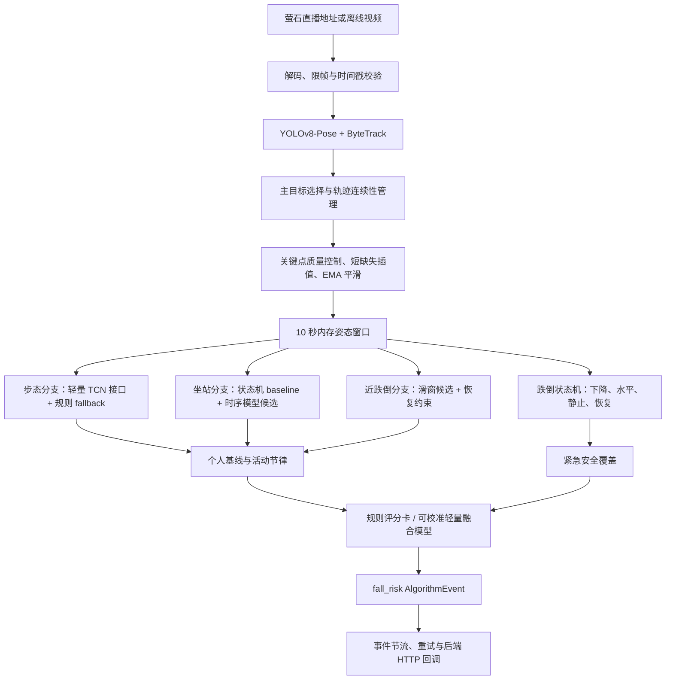
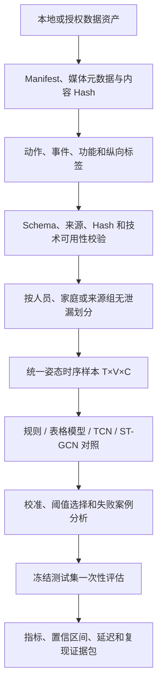

# 居家老人跌倒风险算法技术方案

## 1. 文档目的

本文给出跌倒风险算法的研发执行路线，重点说明每一层的输入、处理方法、技术选型、输出、验证方式和进入主链的门槛。本文属于技术方案，不替代以下事实源：

- 当前实现状态以[跌倒风险模块 README](../README.md)和[算法工程架构](../../../architecture/算法工程骨架.md)为准。
- 当前未完成事项以[任务清单](../../../tasks/README.md)为准。
- 对外字段以[算法事件输出接口](../../../interfaces/算法事件输出接口.md)为准。

本方案的目标不是只识别已经发生的跌倒，而是建立覆盖以下三个时间尺度的风险预警链路：

1. **天级到周级变化**：识别步态、坐站和活动节律相对个人历史的持续变化。
2. **秒级风险事件**：识别踉跄、快速下沉后恢复、急停恢复和疑似扶物等近跌倒事件。
3. **跌倒后安全覆盖**：识别疑似跌倒、倒地静止和恢复状态，为紧急处置提供事件输入。

## 2. 系统边界

### 2.1 本模块负责

- 接收萤石设备、开放平台或离线文件提供的视频流和场景元数据。
- 完成人体检测、跟踪、姿态提取和关键点质量控制。
- 分别计算步态、坐站、近跌倒/跌倒、个人基线和活动节律特征。
- 在跌倒风险模块内部完成风险融合和安全规则校准。
- 输出 `module=fall_risk` 的标准化 `AlgorithmEvent`。
- 提供离线数据处理、训练、评估和实时服务入口。

### 2.2 本模块不负责

- 家属端 App、社区管理后台和可视化看板。
- 账号、权限、设备管理和业务数据库。
- 短信、电话、消息推送和工单流转。
- 医疗诊断、治疗建议或线下处置调度。

## 3. 总体技术路线

### 3.1 实时推理链



### 3.2 数据、训练与评估链



两条链必须共享同一套特征契约、坐标定义、模型版本和配置版本。离线评估有效但实时实现不同，或者实时服务运行但无法复现训练输入，均不能视为完成。

## 4. 分层模块设计

### 4.1 视频接入与时间基准

#### 目标

将直播地址或视频文件转换为具有稳定时间戳的帧序列，同时限制积压和端到端延迟。

#### 输入

| 字段 | 含义 |
|---|---|
| `stream_url` | 可直接解码的短期直播地址或本地视频路径 |
| `device_id` | 摄像头设备标识 |
| `person_id` | 跨时间聚合使用的业务人员标识 |
| `scene_region` | 客厅、床边、卫生间门口等场景编码 |
| `timestamp_sec` / PTS | 视频内相对时间或源时间戳 |

#### 当前技术

- 实时服务通过 OpenCV/视频解码后端读取视频。
- 当前配置最多处理 `8 FPS`，减少轻量设备上的计算压力。
- 姿态缓存保留最近 `10 秒`，默认每 `0.5 秒`重新分析一次。
- 风险融合默认每 `2 秒`更新；近跌倒、跌倒和长时间静止可以立即触发。

#### 关键要求

1. 训练、离线评估和实时推理统一使用真实 FPS 或时间戳，不能假设所有视频具有相同帧率。
2. 断流重连或直播地址更新后必须重置 tracker、姿态窗口和跌倒状态，不能继承旧流状态。
3. 实时队列应保留最新帧而不是积压旧帧；延迟增长时允许丢弃中间帧，但不能改变时间戳语义。
4. `person_id` 与 `track_id` 必须分离：前者表示同一老人，后者只表示单路视频中的临时轨迹。

#### 输出

带 `frame_id`、`timestamp_sec`、设备和场景元数据的视频帧对象。

### 4.2 人体检测、姿态估计与跟踪

#### 目标

从每帧图像中定位人体、提取二维骨架并保持主目标跨帧连续。

#### 技术选择

| 层次 | 当前默认 | 对照或后续候选 | 选择理由 |
|---|---|---|---|
| 人体/姿态检测 | `YOLOv8n-pose` | RTMPose、RTMO、ViTPose | 当前默认依赖少且实时链已验证；RTMPose用于精度对照 |
| 轨迹关联 | ByteTrack | BoT-SORT、OC-SORT | ByteTrack轻量；只有出现明确长遮挡换 ID 问题时再增加 ReID |
| 主目标选择 | 保持原主轨迹；无主轨迹时选择最大人体框 | 场景区域和身份约束 | 避免多人进入时频繁切换分析对象 |

#### 当前关键参数

| 参数 | 默认值 |
|---|---:|
| 检测置信度阈值 | `0.25` |
| IoU 阈值 | `0.50` |
| 主轨迹丢失超时 | `2.0 秒` |
| 坐标输出 | `0-1` 归一化坐标 |

#### 输出契约

```json
{
  "frame_id": 120,
  "person_id": "elder_001",
  "track_id": 3,
  "bbox": [0.31, 0.16, 0.62, 0.91],
  "bbox_pixels": [595.2, 172.8, 1190.4, 982.8],
  "coordinate_system": "image_normalized_0_1",
  "scene_region": "living_room",
  "keypoints": [
    {"name": "left_hip", "x": 0.43, "y": 0.61, "score": 0.91}
  ],
  "pose_confidence": 0.88,
  "keypoint_quality": 0.84,
  "timestamp_sec": 15.2
}
```

默认模式下 `bbox` 与关键点 `x/y` 使用整幅图像的 `0-1` 归一化坐标，`coordinate_system` 为 `image_normalized_0_1`；`bbox_pixels` 保留同一人体框的像素坐标。使用 `--absolute-coordinates` 时，`bbox` 和关键点改为像素坐标，`coordinate_system` 为 `image_pixels`，`bbox_pixels` 仍保留原始像素框。

#### 异常处理

- 主目标短时丢失：保持原 `track_id`，等待丢失超时。
- 主目标超过超时仍未恢复：清空姿态窗口和跌倒状态，再选择新主目标。
- 多人交叉遮挡：质量不足时输出拒识或降低置信度，不把轨迹跳变解释为跌倒。
- RTMPose 无稳定 `track_id` 时：只用于离线姿态对照；进入实时主链前必须与独立跟踪结果绑定。

### 4.3 关键点质量控制与时序平滑

#### 目标

降低遮挡、低光、检测抖动和短时缺失对速度、加速度和动作边界的影响。

#### 处理顺序

```text
按 person_id + track_id 分组
→ 低置信度标记
→ 1-2 帧短缺失插值
→ 单帧质量统计
→ 异常跳变标记
→ EMA 时序平滑
→ 窗口级任务可用性判断
```

#### 当前关键参数

| 参数 | 默认值 | 作用 |
|---|---:|---|
| `min_keypoint_score` | `0.30` | 低于该值的关键点不作为可靠观测 |
| `low_quality_threshold` | `0.45` | 判断低质量帧 |
| `low_quality_run_frames` | `3` | 连续低质量帧门槛 |
| `max_interp_gap_frames` | `2` | 只插值短缺失，不跨越长缺失 |
| `alpha` | `0.40` | EMA 平滑系数 |
| `jump_threshold_norm` | `0.18` | 归一化坐标异常跳变阈值 |
| 质量统计窗口 | `1.0 秒` | 生成下游任务可用性摘要 |

EMA 平滑形式为：

```text
s_t = alpha * x_t + (1 - alpha) * s_(t-1)
```

其中 `x_t` 是当前可靠观测，`s_t` 是平滑坐标。异常跳变点保留在原始数据中，但在平滑和下游计算中降权，便于后续追踪误差来源。

#### 输出

- `x_smooth`、`y_smooth`
- `valid`、`source`
- `is_jump_outlier`
- `core_keypoint_quality`
- `window_quality.usable_for_gait`
- `window_quality.usable_for_sit_stand`
- `window_quality.usable_for_near_fall`

低质量窗口必须输出质量原因，不得被静默填成正常风险分。

### 4.4 时序样本与关键时刻定位

#### 4.4.1 统一时序张量

模型分支统一消费 `[T, V, C]` 张量：

| 维度 | 当前定义 |
|---|---|
| `T` | 时间长度；步态 TCN 当前接口为 64 帧 |
| `V` | 14 个 COCO 兼容关键点 |
| `C` | `x, y, dx, dy, quality` 五个通道 |

构建步骤：

1. 以髋中心或人体框中心消除平移影响。
2. 以肩髋尺度、髋宽或人体框尺度归一化人体大小。
3. 根据真实时间戳重采样，不用固定帧号代替真实时间。
4. 计算一阶位移 `dx, dy`，必要时增加二阶差分。
5. 将关键点置信度、有效性和插值状态写入质量通道或 mask。
6. 不跨越 `track_id` 切换、流重连或长缺失片段插值。

#### 4.4.2 关键时刻定义

跌倒分析中的关键帧是动作阶段边界，不是视频编码 I 帧。一个事件至少区分：

```text
正常状态 → onset 动作开始 → peak 最大失衡 → recovery 恢复
                                  ↘ static 倒地静止
```

当前规则实现主要输出事件 `frame_start/frame_end` 和窗口峰值特征，尚未独立输出 `peak_frame`。目标实现应增加：

```json
{
  "start_frame": 120,
  "peak_frame": 128,
  "end_frame": 139,
  "onset_time": 15.0,
  "peak_time": 16.0,
  "end_time": 17.4,
  "peak_reason": "maximum_lateral_acceleration"
}
```

建议的规则定位方式：

1. 为每帧计算横向速度、横向加速度、髋部下降速度、躯干角速度、腿部压缩和手腕支撑证据。
2. 将各分量归一化后形成帧级异常分数。
3. `peak_frame` 取异常分数最大值对应帧。
4. 从峰值向前搜索，取异常分数连续超过低阈值的第一帧作为 `start_frame`。
5. 从峰值向后搜索，姿态恢复或进入稳定倒地状态时确定 `end_frame`。
6. 使用高低双阈值和最短持续帧数抑制单帧抖动。

关键帧只用于事件边界、证据截图和解释；模型训练仍使用完整时序窗口，因为速度、加速度和恢复过程无法由单帧表示。

### 4.5 步态稳定性分支

#### 目标

输出连续的 `gait_risk_score`，反映当前步态不稳定线索，而不是直接输出最终跌倒等级。

#### 当前规则特征

- 人体中心速度均值、标准差和变异系数。
- 停顿/犹豫帧比例。
- 左右踝运动范围及不对称性。
- 髋部横向摆动和路径偏移。
- 小碎步、低步频和低速度 proxy。
- 躯干倾斜及转身不稳定 proxy。
- 可用帧比例、关键点覆盖率、插值比例和跳变数量。

规则窗口默认 `2 秒`，至少需要 `5 帧`；可用帧比例低于 `0.60` 或步态关键点覆盖率低于 `0.70` 时拒绝高风险判断。

#### 主预测接口

```text
[T,14,5] 姿态窗口
→ 深度可分离轻量 TCN
→ gait_instability probability
→ 校准后 gait_risk_score
```

当前运行框架支持常驻 TCN predictor、规则解释分和显式 fallback，但默认 checkpoint 为 `null`，因此默认仍输出规则结果。只有任务元数据为 `gait_instability_vs_normal_activity` 且通过正式门禁的 checkpoint 才能接入；KINECAL 的跌倒史 proxy 模型不能冒充步态稳定性模型。

#### 模型对照顺序

1. 固定规则分数。
2. 规则特征 + Logistic Regression。
3. 规则特征 + EBM/LightGBM。
4. `[T,V,C]` + 轻量 TCN。
5. 数据量充足后再比较 ST-GCN++/CTR-GCN。

#### 输出

- `gait_risk_score`
- `model_score`
- `fallback_score`
- `score_source`
- `fallback_reason`
- `gait_stability_features`
- `quality_coverage`
- `risk_factors`
- `model_version`

### 4.6 坐站转换分支

#### 目标

定位坐到站、站到坐的事件边界，并评估耗时、失败尝试、支撑使用和站稳能力。

#### 当前状态机方法

1. 监测髋中心垂直位移，变化达到 `0.02` 时生成动作起点候选。
2. 总位移达到 `0.10` 后确认发生姿态转换。
3. 连续 `2 帧`髋部高度变化不超过 `0.018` 时判断姿态稳定。
4. 起立后使用最多 `2 秒`后续窗口计算身体摆动和站稳时间。
5. 结合躯干前倾、疑似支撑和起身失败次数计算局部风险。

#### 当前输出

- `transition_type`
- `duration`
- `failed_attempts`
- `trunk_forward_angle`
- `post_stand_sway`
- `support_usage`
- `stabilization_time`
- `sit_stand_risk_score`
- `risk_factors`

#### 模型增强

- 第一增强模型：事件级 TCN，判断窗口是否为坐站及其局部风险。
- 第二增强模型：MS-TCN++，逐帧输出 `sitting/transition/standing/stabilizing` 相位。
- 数据充分后的对照：ASFormer 或 ST-GCN++。

模型进入主链必须同时改善事件级 F1、事件边界 IoU、onset/offset 误差和局部风险一致性，不能只改善窗口分类准确率。

### 4.7 近跌倒与跌倒状态分支

#### 4.7.1 近跌倒

当前使用 `1.5 秒`窗口、`0.5 秒`步长生成候选，至少需要 `5 帧`。局部特征包括：

- 身体中心横向速度和加速度峰值。
- 行走路径偏移。
- 髋部快速下降及恢复比例。
- 急停前后是否恢复移动。
- 躯干角度变化和角速度。
- 腿部压缩后恢复。
- 手腕快速靠近相对稳定位置的疑似扶物证据。

候选分数达到 `0.25` 后保留；同类型窗口间隔不超过 `0.5 秒`时合并。若整段记录没有窗口达到阈值，当前离线实现仍返回最高分窗口用于调试，因此消费方还必须结合分数阈值判断它是否构成风险事件。当前事件类型包括：

- `stumble_or_lateral_loss`
- `rapid_descent_recovery`
- `sudden_stop_recovery`
- `support_contact_proxy`
- `abnormal_crouch_recovery`
- `unknown_near_fall`

“恢复且未形成稳定倒地”是近跌倒定义的一部分。只检测到快速下降但无法观察恢复时，应输出不确定状态或交给跌倒状态机，不能直接称为近跌倒。

#### 4.7.2 跌倒和长时间静止

当前跌倒状态机在 `1 秒`观察窗口内同时检查：

| 条件 | 当前阈值 |
|---|---:|
| 核心关键点质量 | `>= 0.60` |
| 髋中心向下变化 | `>= 0.18` |
| 人体框中心向下变化 | `>= 0.15` |
| 躯干接近水平角度 | `>= 60°` |
| 疑似跌倒后低运动持续时间 | `>= 10 秒` |
| 静止运动量阈值 | `<= 0.02` |

目标状态机应显式包含：

```text
normal → suspected → confirmed_static → recovered
                         ↘ unresolved
```

当前实现已具有疑似跌倒和长静止分数，但恢复和未解决状态仍需完善。状态升级可立即输出；状态恢复也必须形成可追踪更新，避免同一事件永久保持疑似状态。

#### 增强模型

- 规则候选 + ECOD、Isolation Forest 或 One-Class SVM：近跌倒标签较少时先学习正常行为分布。
- 有标签 TCN/ST-GCN++：在正例、困难负样本和事件边界充足后进行监督训练。
- Transformer AutoEncoder：仅作为后续对照，不作为比赛实时主路径的首选依赖。

### 4.8 个体化行为基线

#### 目标

比较老人当前状态与其本人历史，而不是使用一个固定阈值衡量所有人。

#### 当前基线阶段

| 阶段 | 默认条件 | 处理策略 |
|---|---|---|
| 无历史 | 少于 3 个历史日或少于 10 条记录 | 标记历史不足，不进行正常偏离计算 |
| 初始基线 | 至少 3 天且记录数达标 | 可以输出偏离，但降低置信度 |
| 稳定基线 | 至少 7 天 | 使用最近最多 14 天滚动参考 |

#### 当前统计量

按 `person_id + day/hour` 聚合后，为每项指标保存：

- 均值、标准差、最小值和最大值。
- `P10/P25/P50/P75/P90` 分位数。
- 最近若干期均值和较早历史均值。
- 场景区域出现次数和概率分布。
- 历史天数、记录数和质量均值。

偏离分同时考虑标准化差异、相对变化、分位数越界和近期趋势：

```text
z = 风险方向上的差值 / max(历史标准差, |历史均值|×0.05, 0.05)
```

当前参与偏离融合的方向和权重为：

| 偏离 | 风险方向 | 权重 |
|---|---|---:|
| 步态速度变化 | 下降 | `0.22` |
| 坐站时间变化 | 增加 | `0.28` |
| 近跌倒频率变化 | 增加 | `0.22` |
| 夜间活动变化 | 增加 | `0.10` |
| 活动量变化 | 下降 | `0.12` |
| 场景模式变化 | 罕见场景占主导 | `0.06` |

历史或当前质量低于 `0.60` 时必须降低基线置信度，不能把姿态缺失解释为行为恶化。

#### 在线更新保护

现有实现根据传入历史重建滚动统计，尚未完成安全的在线写回管理。目标实现必须满足：

1. `risk_level >= 2`、近跌倒、疑似跌倒和长时间静止窗口不写入正常基线。
2. 低质量、轨迹切换、相机移动和断流重连窗口不写入基线。
3. 模型或特征版本变化后隔离旧基线，完成兼容验证后才能迁移。
4. 使用 Median/MAD 或截尾统计降低单日异常值污染。
5. 使用 EWMA/CUSUM 检测持续变化，同时限制基线追随异常状态的速度。

### 4.9 风险融合与安全覆盖

#### 当前规则评分卡

基础融合分为：

```text
risk_score =
    0.22 × gait_risk_score
  + 0.18 × sit_stand_risk_score
  + 0.28 × near_fall_event_score
  + 0.16 × baseline_deviation_score
  + 0.08 × scene_risk_score
  + 0.08 × activity_rhythm_score
```

这些系数是工程 baseline，不是临床标定系数。

#### 当前等级规则

| 条件 | 风险等级 | 主触发事件 |
|---|---:|---|
| `fall_event_score >= 0.80` 或 `long_static_score >= 0.80` | 4 | `fall_or_long_static` |
| `near_fall_event_score >= 0.70` 或 `risk_score >= 0.65` | 3 | `near_fall` / `combined_high_risk` |
| `risk_score >= 0.45` | 2 | `mobility_risk` |
| `risk_score >= 0.25` | 1 | `mild_deviation` |
| 其他 | 0 | `normal` |

置信度主要反映输入可靠性：

```text
confidence =
    0.45 × keypoint_quality
  + 0.35 × feature_coverage
  + 0.20 × min(1, risk_score + 0.2)
```

#### 学习型融合路线

在取得同一人员、同一时间范围内配对的分支特征和真实 `risk_labels` 后，按以下顺序对照：

1. 固定规则评分卡。
2. Logistic Regression。
3. EBM/GAM。
4. LightGBM。
5. 数据充分后再评估缺失感知时序融合模型。

学习模型必须显式接收缺失 mask、质量分、基线支持度和模型版本。跌倒与长时间静止规则继续作为安全覆盖，但规则触发必须与 `risk_score`、`risk_level` 和 `confidence` 的语义保持一致。

## 5. 实时服务与事件输出

### 5.1 运行参数

| 参数 | 当前默认值 |
|---|---:|
| 最大推理帧率 | `8 FPS` |
| 姿态内存窗口 | `10 秒` |
| 特征分析间隔 | `0.5 秒` |
| 普通融合间隔 | `2 秒` |
| 主轨迹丢失超时 | `2 秒` |
| 相同事件冷却时间 | `30 秒` |
| 回调超时 | `5 秒` |
| 回调重试延迟 | `0.5/1.0/2.0 秒` |
| 断流重连次数 | `3 次` |

### 5.2 事件契约

```json
{
  "module": "fall_risk",
  "device_id": "ezviz_cam_001",
  "person_id": "elder_001",
  "timestamp": "2026-07-20T14:20:00+08:00",
  "scene_region": "bedroom_bedside",
  "risk_level": 3,
  "risk_score": 0.78,
  "confidence": 0.84,
  "trigger_event": "near_fall",
  "risk_factors": ["near_fall_event", "gait_instability"],
  "recommended_action": "notify_guardian",
  "evidence_window": {"start_time": 15.2, "end_time": 17.1},
  "model_version": "fall-risk-v0.1"
}
```

算法只输出建议动作，业务后端决定是否通知、通知谁以及如何处置。

### 5.3 服务可靠性要求

- 相同 `request_id` 幂等返回原会话。
- 风险等级升级立即回调，0级不回调。
- 同一事件重试复用稳定 `event_id`。
- 回调失败不得终止视频推理。
- 目标实现需要将推理与回调队列解耦，避免 HTTP 超时阻塞取帧和推理线程。
- 弱网、回调 5xx、地址过期、断流重连、多人遮挡和主目标丢失必须分别测试。

## 6. 数据与标签方案

### 6.1 四类任务必须独立建集

| 任务 | 需要的真值 | 可以证明 | 不能证明 |
|---|---|---|---|
| `fall_event` | 跌倒事件起止、onset、恢复状态 | 跌倒事件检测效果和检测延迟 | 长期跌倒风险预测 |
| `near_fall_event` | 近跌倒类型、边界和恢复 | 近跌倒识别和误报控制 | 未来一定会跌倒 |
| `functional_proxy` | TUG、BBS、POMA、SPPB、跌倒史或专家分层 | 功能风险关联和分层一致性 | 纵向提前发现天数 |
| `longitudinal_baseline` | 重复测量、状态变化日期或前瞻结局 | 个人状态变化和提前发现 | 精确跌倒事件边界 |

公开跌倒视频、功能量表、跌倒史和连续个人监测数据不能互相替代真值。

### 6.2 数据划分

1. 优先按 `subject_id` 划分训练、验证和测试集。
2. 无法恢复人员身份时，至少按保守 `source_group_id` 隔离。
3. 同一原视频、相邻窗口、增强副本和重复内容不得跨集合。
4. 验证集用于模型、阈值和校准器选择；测试集冻结后只执行一次正式评估。
5. 每次实验记录 `dataset_version`、`split_id`、配置 hash、代码版本和模型 hash。

### 6.3 困难样本

正样本至少覆盖横向踉跄、快速下沉后恢复、急停恢复、异常下蹲后恢复和快速扶物。困难负样本至少覆盖：

- 弯腰捡物、系鞋带、整理床铺。
- 快速坐下、正常坐站、跪地取物。
- 正常转身、绕障、伸展和居家锻炼。
- 多人交叉、护理员遮挡和主目标短时消失。
- 拐杖、助行器、宽松衣物和下肢出画。
- 夜间低光、背光、视频压缩和相机抖动。

## 7. 训练与模型替换流程

每个分支独立执行以下流程：

```text
标签通过 formal 校验
→ 冻结 task-specific split
→ 固定统一预处理和样本张量
→ 训练规则/表格/时序模型对照
→ 验证集选择模型、阈值和校准器
→ 误报漏报与低质量拒识分析
→ 冻结候选 checkpoint
→ 测试集一次性评估
→ 实时延迟和稳定性验证
→ 决定是否进入主链
```

### 7.1 模型进入主链的必要条件

- 标签来源、媒体关联和 hash 完整，`formal_ready=true`。
- 按人员、家庭或来源组完成无泄漏划分。
- 在同一 split 和同一指标下与规则 baseline 比较。
- 独立测试结果给出 95% 置信区间，不只报告单一最佳数值。
- 高风险召回、每摄像机小时误报、校准和拒识均满足预注册要求。
- 固定硬件上 P50/P95 延迟和内存占用达标。
- checkpoint 声明的任务、关键点定义、通道、窗口和归一化方式与运行时完全一致。
- 模型不可用、输入低质量或推理失败时能够显式回退并记录原因。

任何一项不满足，模型只保留为离线实验，不替换实时主路径。

## 8. 评估指标

### 8.1 事件任务

- 事件级 Precision、Recall、F1 和 PR-AUC。
- 高风险事件召回率和漏报率。
- 时间窗 IoU、onset 误差和恢复状态准确率。
- 每摄像机小时误报数；只有连续监控时长合法时才报告。
- 跌倒检测延迟和近跌倒 onset detection latency，二者分开统计。
- 具有后续参考事件时才计算正向提前量。

### 8.2 功能和纵向任务

- AUROC、PR-AUC、Balanced Accuracy 和分层一致性。
- Brier score、ECE 或可靠性曲线。
- 固定误报水平下的变化检出率。
- 具有真实状态变化日期时报告提前发现天数。

### 8.3 工程指标

- 解码、姿态、分支推理、融合和回调的 P50/P95 延迟。
- 有效处理 FPS、丢帧比例、内存和 CPU/GPU 使用量。
- 低质量拒识覆盖率和错误接受率。
- 断流恢复时间、回调成功率和连续运行稳定性。

### 8.4 消融实验

至少比较：

1. 仅跌倒事件检测。
2. 完整规则 baseline。
3. 去掉近跌倒分支。
4. 去掉个体基线。
5. 去掉质量拒识。
6. 规则分支替换为候选时序模型。

消融必须使用相同数据、相同 split、相同阈值选择规则和相同评估代码。

## 9. 当前工程起点与缺口

本节只说明本方案的实施起点，不作为持续维护的状态事实源。最新状态仍以模块 README、工程架构和任务清单为准。

| 层次 | 工程起点 | 主要缺口 |
|---|---|---|
| 感知 | YOLOv8-Pose + ByteTrack 实时链和 RTMPose 离线适配已具备 | 真实萤石设备与复杂场景验证不足 |
| 质量控制 | 过滤、短插值、跳变标记和 EMA 已具备 | 需做跨视角阈值校准和替代平滑对照 |
| 步态 | TCN 推理接口与规则 fallback 已具备 | 无通过门禁的 RGB 步态 checkpoint；现有 KINECAL 跌倒史模型不可接入 |
| 坐站 | 规则状态机和局部风险特征已具备 | 缺少任务级时序模型和正式事件边界评估 |
| 近跌倒/跌倒 | 规则滑窗、恢复 proxy 和跌倒状态机已具备 | 近跌倒真值不足；恢复状态和困难负样本需完善 |
| 个体基线 | 3-14 天统计偏离原型已具备 | 缺连续个人真值、在线写回保护和冷启动验证 |
| 融合 | 规则评分卡和安全强触发已具备 | 系数未用真实风险标签校准 |
| 数据评估 | Manifest、校验、split builder 和事件评估器已具备 | 无正式冻结数据、协议和盲测结果 |
| 服务 | 单进程单路 HTTP 原型已具备 | 真实萤石联调、回调解耦、性能与弱网验证未完成 |

## 10. 不绑定日期的阶段路线

### 阶段 A：建立可信数据和评估底座

**工作内容**

- 处理来源不明、技术不可用、重复和不确定标签。
- 分别补充 near-fall、functional proxy 和 longitudinal baseline 真值。
- 冻结任务级 split、事件匹配规则和统计分析方案。

**退出条件**

- `formal_ready=true`。
- 每个可启动任务都有非空冻结 split 和稳定 `split_id`。
- 评估命令可以输出指标、原始预测、失败案例和版本信息。

### 阶段 B：局部分支模型化

**工作内容**

- 步态：规则、表格模型、轻量 TCN 和 ST-GCN 受控对照。
- 坐站：状态机与事件 TCN/MS-TCN++ 对照。
- 近跌倒：规则候选、异常检测和监督时序模型对照。
- 补充关键时刻 `onset/peak/recovery/static` 输出。

**退出条件**

- 至少一个分支在独立测试、校准、误报和延迟上稳定优于规则 baseline。
- 新模型具有任务元数据校验和显式 fallback。
- 失败场景和支持边界形成版本化报告。

### 阶段 C：个人基线闭环

**工作内容**

- 建立无历史、初始基线和稳定基线三个状态。
- 增加异常数据禁止写回、模型版本隔离和稳健统计。
- 用连续个人数据验证 EWMA/CUSUM 或变点检测。

**退出条件**

- 冷启动不产生虚假高风险。
- 高风险和低质量窗口不会污染正常基线。
- 基线分支在配对数据上具有可复现增益。

### 阶段 D：风险融合与校准

**工作内容**

- 在配对风险标签上对比规则评分卡、Logistic、EBM 和 LightGBM。
- 校准风险概率和风险等级阈值。
- 完成去近跌倒、去基线、去质量拒识等消融。

**退出条件**

- 风险分数具有可解释的概率或排序语义。
- 低质量和缺失输入不会产生过高置信度。
- 紧急安全规则与学习模型输出不存在语义冲突。

### 阶段 E：真实设备与部署验证

**工作内容**

- 完成真实萤石直播地址、会话、推理和后端回调闭环。
- 解耦取帧、推理和回调，增加可观测指标。
- 执行连续运行、断流、地址刷新、弱网、回调失败、多人和遮挡测试。

**退出条件**

- 真实设备完成 3 级和 4 级事件端到端验收。
- 固定硬件上的延迟、吞吐和资源消耗满足预注册预算。
- 全新环境可以按部署文档复现同一模型、配置和事件输出。
