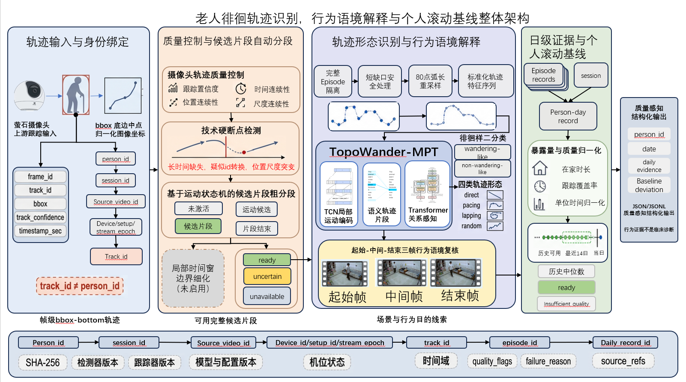
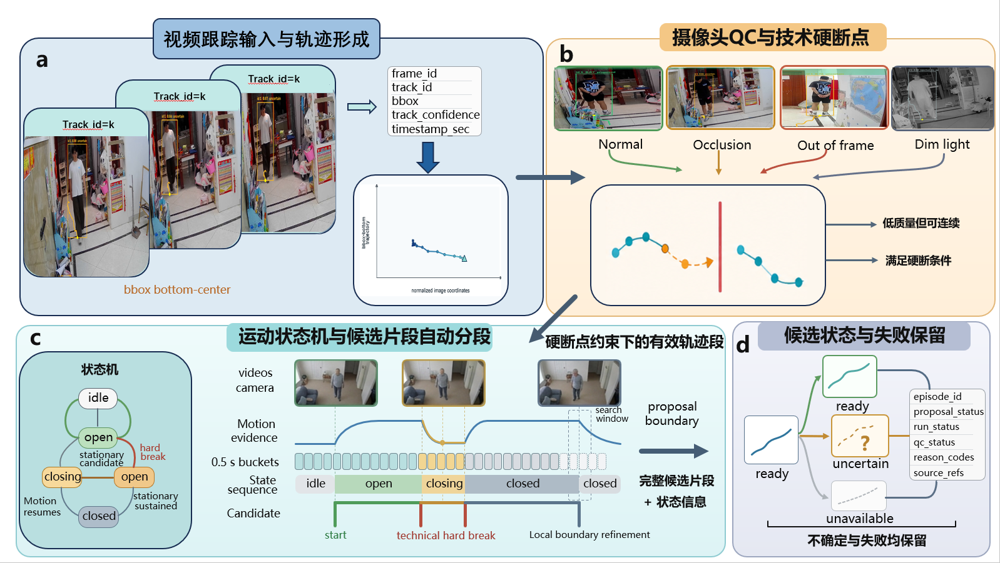
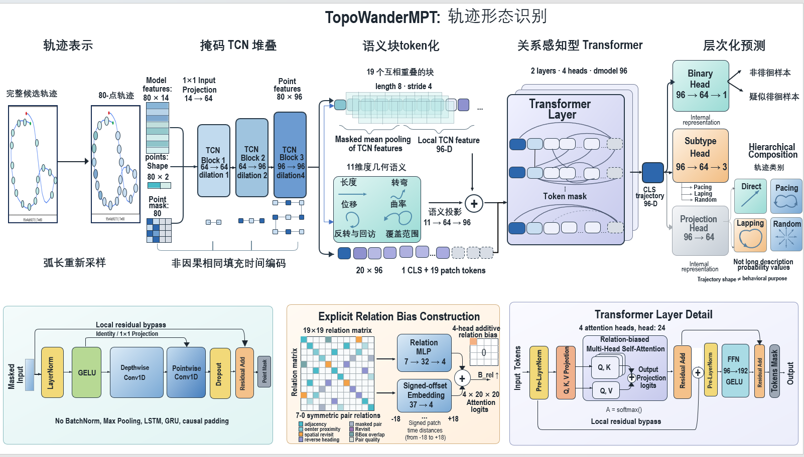

# 比赛主文档徘徊章节与配图规划

版本：v1.1
更新时间：2026-08-23
适用范围：比赛主文档第 5.5 至 5.7 节
文档属性：章节与配图规划，不作为当前代码状态或实验数值的唯一事实源

## 1. 文档目的与使用规则

本文用于规划比赛主文档中徘徊模块的叙事顺序、三级标题内容、主图位置、表格位置、结果分配和证据边界。正式撰写时应先按本文固定章节任务和图表位置，再从现行事实源提取可复核内容，避免正文、图注和实现状态互相矛盾。

当前事实与实验数值应优先核对：

1. [心理健康模块 README](../README.md)：当前实现状态和能力边界；
2. [徘徊识别技术文档2](徘徊识别技术文档2.md)：现行技术语义；
3. [当前任务表](../../../tasks/README.md)：尚未完成事项和人工门；
4. [居家视频分段与分类修复报告](../../../../reports/mental_health/wandering_camera_home_repair_v1/README.md)：修复后的 development 数值、失败案例和适用边界；
5. [W5D-T4 真实日报与个人基线](M0-CAM-5D-T4真实日报与个人基线.md)：日级聚合、基线成熟度和严格先验窗口。

本文规划的正文只能支持以下层级的结论：

- 摄像头轨迹处理、候选分段、轨迹形态识别、多模态语境复核、日级聚合和个人基线已经形成可运行算法闭环；
- 当前定量结果来自同一 participant/home setup 的 development 调参与复评；
- 结果不是独立测试、跨人员或跨机位泛化证据，也不是临床诊断或医学有效性证据；
- 徘徊轨迹是 `module=mental_health` 下的行为证据，不直接等同于心理疾病、认知障碍或临床结论。

## 2. 总体叙事与篇幅分配

第 5.5 至 5.7 节应形成一条连续证据链：

```text
摄像头视频与显式身份绑定
  -> 可信人体观测与技术硬断点
  -> 候选片段粗分段和局部边界细化
  -> 完整片段轨迹隔离与 80 点重采样
  -> TCN + 语义片段 + 关系感知 Transformer
  -> 徘徊样二分类与四类轨迹形态
  -> 三帧行为目的复核和失败开放
  -> 会话级聚合与单位时长归一化
  -> 严格先验的最近 14 个可用日个人基线
  -> 日级证据、偏离和质量状态
```

建议篇幅按内容重要性分配：

| 章节 | 建议占比 | 章节任务 |
|---|---:|---|
| 5.5 | 30% | 解释摄像头输入如何变成边界可追溯的候选片段 |
| 5.6 | 45% | 解释轨迹模型、分类输出、多模态目的复核和主要分类结果 |
| 5.7 | 25% | 解释片段级结果如何变成日级证据和严格先验个人基线 |

正文采用“方法定义 -> 代表性实例 -> 主定量证据 -> 失败边界 -> 下一级输出”的顺序。不要把研发时间线、任务编号和大量实现文件名写入主文档；这些内容保留在技术附件或项目文档中。

## 3. 术语表与全章统一约定

| 统一术语 | 首次出现时的解释 | 不应混用的说法 |
|---|---|---|
| 人员标识 `person_id` | 跨会话聚合所使用的显式匿名人员身份 | 不得用 `track_id` 推断人员 |
| 跟踪标识 `track_id` | 单视频或短时间范围内的跟踪身份 | 不写成长期人员身份 |
| 机位标识 `camera_id/setup_id` | 摄像头和部署机位身份 | 不写成房间真实坐标系 |
| 正式轨迹点 `bbox_bottom_point` | 人体检测框底边中心的归一化图像坐标 | 不使用检测框几何中心 |
| 行为父片段 `behavior parent` | 状态机生成的行为级候选片段 | 不与微观运动片段混为一组统计 |
| 微观运动片段 `motion bout` | 父片段内部经层级解析得到的局部走动单元 | 不写成独立人工 episode |
| 解析层级结果 `resolved hierarchy` | 父片段和微观运动片段的层级化输出 | 不与 parent 指标共用分母 |
| 徘徊样 `wandering_like` | 二分类中的徘徊样轨迹形态 | 不直接写成临床徘徊诊断 |
| 四类轨迹形态 | `direct/pacing/lapping/random` | 不与行为目的类别混用 |
| 行为目的 `purpose/context` | 电话、寻找、清洁、锻炼、社交等语境解释 | 不得反向修改 shape、boundary 或人工 truth |
| 边界状态 `boundary_status` | `proposed/uncertain` 等边界可信状态 | 不与预测是否成功混用 |
| 预测状态 `prediction_status` | `ready/unavailable/error` | `uncertain` 边界不等于模型不可预测 |
| 可用日 `usable day` | 满足身份、在家时长和跟踪覆盖要求的日期 | 缺失日不得填充为零 |
| 严格先验基线 | 只使用当前观察日之前的可用日建立的参考 | 不得把当日数据纳入自身参考窗 |

## 4. 主图、表格和放置位置总览

最终图号需与完整比赛文档统一。本文暂用 `W-F0` 作为整章总览图，`W-F1` 至 `W-F5` 作为五张主图，`W-S1` 作为可选支持图。三张已完成的设计稿均已存入仓库稳定目录；它们当前属于排版和语义待复核的设计稿，不自动构成实验结果证据。

| 工作编号 | 建议插入位置 | 图形类型 | 图要证明的核心结论 | 当前准备状态 |
|---|---|---|---|---|
| W-F0 | 5.5 开篇、5.5.1 之前 | 整体架构示意 | 徘徊模块从可信摄像头轨迹，经候选分段、形态识别和语境复核，最终形成质量感知的日级证据与个人基线 | 已有设计稿，需完成状态语义和文字清理 |
| W-F1 | 5.5.2 之后 | 图像板 + 方法示意 | 视频跟踪经底点轨迹、QC、硬断点和运动状态机形成可追溯候选，并显式保留不确定与失败 | 已有设计稿，需拆分边界状态与预测状态 |
| W-F2 | 5.5.5 之后 | 定量网格 + 边界实例 | 状态机和局部细化提高 parent 分段效果，同时保留 resolved 召回视图和失败状态 | 数值已具备，最终结果图待绘 |
| W-F3 | 5.6.2 之后 | 架构主导组合图 | 80 点轨迹通过 TCN、语义片段和关系感知 Transformer 形成分层分类表征 | 已有设计稿，所有维度和超参数待逐项核对配置/检查点 |
| W-S1 | W-F3 之后或技术附件 | 注意力热力图 + 特征分布 | 同批 development 样本中，模型关注分布和投影表征可被描述性检查 | 待从冻结样本和模型输出生成 |
| W-F4 | 5.6.6 之后 | 非对称混合模态图 | 系统输出二分类和四类形态，并用三帧语境独立解释行为目的和失败状态 | 轨迹与三帧素材已有，最终组合图待绘 |
| W-F5 | 5.7.5 之后 | 折线 + 分位带 + 状态图 | 会话级证据经覆盖率归一化后进入严格先验的个人滚动基线 | JSONL 数据已有，最终图待绘 |

建议配套表格：

| 工作编号 | 放置位置 | 内容 | 主文或附件 |
|---|---|---|---|
| W-T1 | 5.5.1 末尾 | 人员、会话、视频、机位、Track 和时区字段关系 | 主文简表 |
| W-T2 | 5.6.4 末尾 | 二分类、四分类、质量、边界状态和预测状态字段 | 主文简表 |
| W-T3 | 5.7.5 末尾 | 日报、基线、偏离和质量状态字段 | 版面充足时放主文，否则放技术附件 |

如果比赛主文档版面紧张，优先保留 W-F0、W-F2、W-F4 和 W-F5；将 W-F1、W-F3 与 W-S1 移入技术附件，并在正文首次引用处保留缩略图或交叉引用。压缩时不能删除 random 失败、parent/resolved 分母差异或真实两日与 15 日 replay 的证据边界。

### 4.1 三张已设计图的固定安排与终稿修订

**W-F0：整章总览图**



- **固定位置**：5.5 开篇总述之后、5.5.1 之前；图内四个纵向阶段分别为 5.5 输入与分段、5.6 形态与语境、5.7 日级证据与基线以及结构化输出。
- **图级作用**：建立全章视觉词汇和端到端数据流，不承担当量性能证明；正文中的 P/R/F1、分类 recall 和日级结果仍由 W-F2、W-F4 和 W-F5 提供。
- **终稿前必须修订**：将“局部时间窗边界细化（未启用）”改为与现行实现一致的启用/触发语义；将 `ready/uncertain/unavailable` 改为 `boundary_status` 与 `prediction_status` 两条独立状态链；统一 `TopoWander-MPT`、`bbox_bottom_point` 和各身份字段命名；清除红色拼写检查波浪线。
- **建议图题**：“老人徘徊轨迹识别、行为语境解释与个人滚动基线整体架构”。

**W-F1：5.5 方法图**



- **固定位置**：5.5.2 末尾；后续 5.5.3–5.5.5 继续引用其中 c、d 面板。
- **章节映射**：a 对应 5.5.1；b 对应 5.5.2；c 对应 5.5.3 和 5.5.4；d 对应 5.5.5。W-F1 只解释方法与状态流，W-F2 负责分段数值和失败案例。
- **终稿前必须修订**：在 b 中明确遮挡、暗光和短时出画是质量压力，不自动等于硬断点；在 d 中把 `proposal_status/run_status` 统一为现行 `boundary_status/prediction_status`，允许 `boundary_status=uncertain` 与 `prediction_status=ready` 并存；统一中英文、大小写和字体，并清除拼写检查波浪线。
- **建议图题**：“摄像头跟踪、质量控制、运动状态机分段与失败保留”。

**W-F3：5.6.2 模型结构图**



- **固定位置**：5.6.2 末尾，横向通栏；上半部分作为主阅读路径，下半部分解释局部残差块、显式关系偏置和 Transformer 层细节。
- **图级作用**：解释 80 点弧长重采样、TCN 局部编码、语义片段、关系感知 Transformer 与分层输出头之间的关系，不承担分类性能或泛化证明。
- **终稿前必须修订**：把标题和正文中的模型名统一为主文采用的标准写法；逐项用现行配置和冻结检查点核对 `80×14`、通道数、patch 数、长度/步幅、`dmodel`、层数、注意力头数及输出头维度；若主文不展开实现细节，将下半部分移入技术附件并保留上半部分；清理中英文断行和拼写问题。
- **配套结果**：该图本身没有真实注意力热力图和 PCA/UMAP 特征分布，这两类输出独立安排为 W-S1，禁止把关系偏置构造示意当成真实样本注意力结果。
- **建议图题**：“完整轨迹的 80 点表征、局部时序编码与关系感知建模”。

## 5.5 摄像头轨迹处理与徘徊候选片段自动分段

本节回答的问题是：如何从连续摄像头跟踪结果中，生成身份可追溯、质量可判断、边界可复核且失败不丢失的徘徊候选片段。

> **W-F0 插入位置**：放在本段之后、5.5.1 之前。正文用一句话引导读者按“轨迹输入与绑定—QC 与分段—形态与语境—日级证据与基线”的方向阅读整章。

### 5.5.1 视频跟踪输入与人员、会话和机位身份绑定

**写作任务**

1. 先定义输入不是原始视频像素本身，而是视频身份、帧时间、人体检测框、Track、检测置信度和显式业务绑定共同组成的跟踪输入。
2. 说明 `person_id`、`session_id`、`source_video_id`、`camera_id/setup_id`、`timezone` 和 `track_id` 的作用域。
3. 强调 `track_id` 只表示短时跟踪身份，不能替代人员身份；跨会话和跨日聚合必须依赖显式 `person_id/session/timezone` 绑定。
4. 说明正式轨迹使用归一化 `bbox_bottom_point`，该点近似人物与地面的接触位置，比检测框几何中心更适合描述平面移动。

**建议段落结构**

- 第 1 段：输入字段和时间轴；
- 第 2 段：身份作用域与禁止推断关系；
- 第 3 段：检测框到底点轨迹的坐标转换。

**图表安排**

- W-F1a：三帧连续画面显示人体检测框、`track_id` 和置信度，并由 `bbox_bottom_point` 形成归一化图像坐标轨迹；
- W-T1：身份字段及其作用域简表。

**必须保留的边界**

- CVAT rectangle 在当前 development 评价中只承载时间段和行为语义，不是检测或跟踪真值；
- 不报告检测框准确率、ReID 准确率或跨摄像头身份识别能力，除非以后有独立人工真值。

### 5.5.2 摄像头质量控制与技术硬断点

**写作任务**

1. 说明只有 `track_confidence >= 0.70` 的人体观测可以形成正式轨迹、参与运动量计算、边界生成、QC 和 shape 推理；低置信观测只保留为关联或诊断信息。
2. 区分质量压力条件与技术硬断点：遮挡、暗光和短时出画会降低质量，但不自动等同于硬断点；长 gap、身份冲突、stream epoch 变化、摄像头移动和 Track 结束可形成不可跨越的技术边界。
3. 说明硬断点的作用是阻止不同身份、不同时间域或不可连续观测被错误拼接成一个 episode。
4. 引出统一 locomotion evidence：分段器和 episode QC 应消费同一份可信运动证据，避免同一片段先成段、后被另一门禁无解释拒绝。

**建议段落结构**

- 第 1 段：可信轨迹门槛；
- 第 2 段：质量压力与硬断点的区别；
- 第 3 段：QC 与分段共享证据。

**图表安排**

- W-F1b：正常、遮挡、短时出画和暗光的代表性小图，以及质量压力与硬断点的时间连续性示意；
- 图中使用绿色表示可信连续轨迹、橙色表示质量压力、红色竖线表示不可跨越硬断点，不能仅凭画面变暗就画出硬断点。

**不应绘制的内容**

- 当前主链没有像素级人体实例分割，不放置或宣称“分割掩码输出”；
- 模型中的 `point_mask` 是 80 点轨迹有效性掩码，只能画成有效点条带，不能画成人体轮廓。

> **W-F1 插入位置**：放在本小节末尾。图题建议为“摄像头跟踪、质量控制、运动状态机分段与失败保留”。

### 5.5.3 基于运动状态机的候选片段粗分段

**写作任务**

1. 说明以 0.5 秒 bucket 为主要统计尺度，对可信底点轨迹进行稳健平滑，并从静止片段估计检测框抖动噪声。
2. 描述 `idle -> open -> closing -> closed` 的状态转换，以及 opening/closing 使用不同阈值的 hysteresis。
3. 说明持续净位移、空间 extent、有效速度和超噪声步数共同决定候选打开；不能用无限累积的微小抖动代替真实移动。
4. 说明短暂停、犹豫、转向、折返和闭环默认保持在同一个行为父片段内。
5. 介绍 behavior parent 与 motion bout：父片段描述连续行为，微观片段用于解析局部走动；多次独立取物不能仅因时长较长而被合并成 lapping。

**建议段落结构**

- 第 1 段：bucket、平滑和噪声基线；
- 第 2 段：状态机和 hysteresis；
- 第 3 段：父片段与微观运动片段的层级关系。

**图表安排**

- W-F1c：运动证据、0.5 秒 bucket、状态机状态和粗候选边界的共用时间轴；
- W-F2a：选取一个可追溯 episode，展示行为父片段及内部 motion bout，为后续边界数值提供代表性实例；
- 两图均必须标出短暂停后回到 `open`，以及硬断点不能跨越。

### 5.5.4 局部时间窗边界细化

**写作任务**

1. 说明粗边界用于稳定发现候选，局部细化只在粗边界附近约 2 秒范围内重新检查原始时间戳。
2. 说明局部尺度约为 0.25 秒 bucket，通过更细的 opening/closing hysteresis 修正起止时间。
3. 同时保留 coarse boundary 与 refined boundary，支持错误回溯和结果复算。
4. 强调 refinement 不能跨越技术硬断点、覆盖人工 truth 或把 uncertain 改写为人工接受边界。

**建议段落结构**

- 第 1 段：为什么需要粗到细两级边界；
- 第 2 段：局部时间窗和双边界保留；
- 第 3 段：细化的禁止事项。

**图表安排**

- W-F1c：在方法时间轴上用局部搜索窗说明 coarse-to-refined 的处理位置；
- W-F2b：同一案例上叠加人工时间段、粗边界、细化边界、父片段和 resolved bout；
- 使用放大镜式局部 inset 展示边界细化，不另画一张独立流程图。

### 5.5.5 候选状态、不确定性与失败保留

**写作任务**

1. 分开解释 `boundary_status` 与 `prediction_status`：边界不确定并不自动意味着模型不可推理。
2. 说明满足统一可信轨迹和 locomotion 门禁的 `uncertain` 候选仍可输出 `prediction_status=ready`，但不得宣称为人工接受边界。
3. 说明真正缺少可信轨迹、身份冲突、有效点不足、坐标或时间无效时，输出 `unavailable/error` 并保留原因码。
4. 解释 parent 与 resolved 两个视图服务不同目标：parent 是精度和 F1 主视图，resolved 是问题优先的召回视图，不能把两层当作一个互斥候选集计算或展示。
5. 用一段话总结当前修复后的 development 结果和失败边界。

**主文建议保留的数值**

- 修复前 automatic parent：Precision/Recall/F1=`0.566038/0.666667/0.612245`；
- 修复后 behavior parent：Precision/Recall/F1=`0.802920/0.814815/0.808824`；
- resolved hierarchy：Recall/F1=`0.938931/0.656000`，作为召回视图单独报告；
- `137/137` 个父候选 prediction ready，`0` unavailable；
- 0.70 门槛下可信观测覆盖率为 `0.834809`，135 条人工时间段中 131 条达到 0.80 时序覆盖。

**图表安排**

- W-F1d：分别显示 `boundary_status` 与 `prediction_status`，并用 `reason_codes/source_refs` 保留不可用或失败原因；
- W-F2c：修复前后 parent Precision、Recall、F1 分组柱状图；
- W-F2d：resolved recall 单独点图或单独小面板，并显示低覆盖、碎片化和静止抖动失败案例；
- 不能把 resolved recall 与 parent precision 放入同一组柱子，图注必须写明分母差异。

> **W-F2 插入位置**：放在本小节末尾，作为 5.5 的主结果图。图题建议为“召回优先的候选分段、边界细化与失败保留”。

**5.5 节结尾过渡句任务**

用一至两句说明：完成身份绑定、QC 和边界生成后，每个候选片段都保留完整时间范围、可信轨迹、质量状态和来源身份，从而为下一节的完整片段形态识别提供输入。不要在本节提前解释 TCN 或四分类结果。

## 5.6 徘徊轨迹形态识别与多模态行为语境解释

本节回答的问题是：如何在不使用行为目的生成边界的前提下，从完整候选轨迹中识别徘徊样形态，并通过独立的三帧语境层补充行为目的解释。

### 5.6.1 完整片段轨迹隔离与80点弧长重采样

**写作任务**

1. 说明每个候选只能按 `source_video_id + target_track_id + start/end` 隔离对应完整轨迹，不得混合多个 Track、会话或机位。
2. 说明预处理先校验有效点、坐标、时间和质量，再对完整路径进行平移、尺度和方向相关的规范化。
3. 解释弧长重采样将不同持续时间和采样密度的轨迹统一为 80 点，使模型重点处理空间形态而不是原始帧率。
4. 说明 `point_mask` 用于标记 80 点输入中的有效位置，缺失不能被无声填成真实运动。

**建议段落结构**

- 第 1 段：完整候选隔离；
- 第 2 段：质量校验和轨迹规范化；
- 第 3 段：80 点弧长重采样及其作用。

**图表安排**

- W-F3 左侧输入区：完整候选轨迹、规范化轨迹和 80 点重采样结果；
- 起点和终点全章统一使用相同符号和颜色；
- W-F3 用一个可追溯样本解释输入变换，四类代表性与困难样本放入 W-F4，避免在结构图中重复堆叠轨迹小图。

### 5.6.2 时序卷积、语义片段与关系感知Transformer建模

**写作任务**

1. 先说明 TCN 编码相邻轨迹点的局部运动变化，包括方向、曲率、折返和局部连续性。
2. 说明 80 点序列被汇聚为语义轨迹片段，每个片段结合局部 TCN 表征和几何语义。
3. 说明关系感知 Transformer 不只处理片段顺序，还通过片段间相对位置、方向和几何关系建立注意力偏置。
4. 说明全局 `CLS` 表征进入二分类头、四分类头和投影表征；camera geometry subtype 作为 development 范围内的辅助形态修正，不应画成行为目的模型。
5. 方法正文描述结构和输入输出，层数、通道数、dropout 和完整超参数放入技术附件或模型配置表，避免主文被实现细节淹没。

**建议段落结构**

- 第 1 段：TCN 的局部运动编码；
- 第 2 段：语义片段构造；
- 第 3 段：关系偏置与 Transformer；
- 第 4 段：全局表征和输出头。

**图表安排**

- W-F3 上半部分：以“80 点输入 -> TCN -> 语义片段 -> 关系感知 Transformer -> 分层输出头”为主阅读路径；
- W-F3 下半部分：分别解释局部残差块、显式关系偏置和 Transformer 层，只保留正文理解所需的结构；
- W-S1a：从冻结样本生成真实关系注意力矩阵，并将 `CLS-to-patch` 权重映射回轨迹；
- W-S1b：投影表征的 PCA 或 UMAP 分布，分别展示二分类和四类形态；
- W-F3 中出现的全部层数、通道、patch、维度和输出头数值必须从现行配置和冻结检查点逐项核对，设计稿文字不能直接充当实现证据。

**解释边界**

- 注意力图只能称为“关系注意力可视化”或“模型关注分布”，不能写成因果解释；
- PCA/UMAP 只能作为同批 development 表征的描述性视图，不能单独证明跨人员泛化；
- 训练 loss 曲线不是本章主证据，除非比赛模板明确要求，否则移入技术附件。

> **W-F3 插入位置**：放在本小节末尾。图题建议为“完整轨迹的 80 点表征、局部时序编码与关系感知建模”。W-S1 在版面允许时紧随其后，否则进入技术附件并由本小节引用。

### 5.6.3 徘徊样二分类与四类轨迹形态输出

**写作任务**

1. 明确二分类是摄像头主输出：`direct_or_non_wandering` 与 `wandering_like`。
2. 说明四分类输出 `direct/pacing/lapping/random`，用于描述轨迹形态和诊断类别混淆。
3. 解释二分类概率、四分类概率、最终类别、模型身份和配置身份共同保留，支持复算与失败追踪。
4. 报告修复后 resolved 全链结果，并把 random 的明显短板放在主文，而不是隐藏到附件。

**主文建议保留的数值**

- resolved 全链 accuracy=`0.885496`，macro-F1=`0.762286`；
- direct/pacing/lapping/random recall=`0.933962/0.888889/0.875000/0.250000`；
- random support 仅为 8，必须与 recall 一起说明。

**图表安排**

- W-F4a：四分类混淆矩阵，作为主要分类证据；
- W-F4b：四类 recall 柱状图，所有柱顶标精确值和 support；
- 二分类若需要展示，使用紧凑概率分布或混淆矩阵小面板，不与四分类柱状图重复占用大面积。

### 5.6.4 轨迹质量与置信度分层

**写作任务**

1. 说明最终可信度不只由 softmax 概率决定，还包括边界状态、可信观测覆盖、有效点数、运动证据、身份一致性和模型运行状态。
2. 分开写 high-confidence、boundary-uncertain、unavailable 和 error 的含义及下游用途。
3. 说明 `boundary_status=uncertain` 且 `prediction_status=ready` 的候选仍可进入候选统计，但必须在日级结果中单独分层。
4. 不建立未经校准的“综合置信度总分”；如果没有正式 calibration，只展示组成字段和状态分层。

**图表安排**

- W-F4c：代表性样本的概率条、覆盖率条和状态徽标；
- W-T2：边界状态、预测状态、二分类、四分类和质量字段简表。

### 5.6.5 起始—中间—结束三帧行为语境复核

**写作任务**

1. 说明多模态 context 仅在 `wandering_like`、uncertain 或指定失败案例上触发，不对所有片段无差别调用。
2. 说明每个触发片段抽取开始、中间和结束三帧，同时保留完整场景联系图和人物 crop。
3. 描述多模态输入还包括时间戳、episode identity 和 tracking/QC 摘要。
4. 说明输出为 `phone_call/searching/cleaning/exercise/social/other/unknown` 等行为目的、provider 状态、置信度和引用信息。

**建议段落结构**

- 第 1 段：触发条件；
- 第 2 段：三帧与场景/crop 输入；
- 第 3 段：输出字段和可追溯性。

**图表安排**

- W-F4d：起始、中间、结束三帧横向排列，每个时间点上方放完整场景，下方放人物 crop；
- 帧区域先使用完整绘制或匿名真实帧，保留固定比例，后续替换真实图片时不改变整体版式。

### 5.6.6 轨迹形态与行为目的分离及失败开放机制

**写作任务**

1. 用一个清晰例子解释 shape 与 purpose 正交：来回走的轨迹可以是 `pacing`，同时目的可以是 `exercise` 或 `searching`。
2. 说明 context 不能修改 shape、boundary、人工 truth、阈值或模型类别。
3. 说明 context provider 失败时，输出 `unknown/unavailable/error`，轨迹分类、日报和基线继续运行。
4. 说明算法不会用预测反向裁决人工标注；当前仍待人工处理的 evaluation-role 冲突不进入算法自动决定。
5. 以 random recall 低、低照 QC 和真实长期观察不足作为本节结尾的主要失败边界。

**图表安排**

- W-F4e：二维“轨迹形态 × 行为目的”示意矩阵；
- W-F4f：成功案例、目的性困难负样本和 provider unavailable 三条输出路径；
- 代表性可视化应包含人体框、底点轨迹、类别概率、状态和三帧语境，但不放像素级分割掩码。

> **W-F4 插入位置**：放在本小节末尾，作为 5.6 的主结果与可解释输出图。图题建议为“轨迹形态识别、三帧行为语境复核与失败开放输出”。

**5.6 节结尾过渡句任务**

用一至两句说明：片段级 shape、purpose、边界状态和质量标志仍是离散证据，不能直接代表个人长期异常；因此需要按人员、日期和有效观察时长聚合，并与严格早于当日的个人历史比较。

## 5.7 徘徊日级证据与个人滚动基线

本节回答的问题是：如何把分散的候选片段转化为可比较的日级行为证据，并在不使用未来信息和不伪造缺失值的前提下建立个人参考。

### 5.7.1 会话级结果聚合与日级报告

**写作任务**

1. 定义日级聚合键为 `person_id + local_date + timezone`，不同人员、日期和时区不得混合。
2. 说明输入包括 session/episode 结果、context 结果、身份绑定和 presence intervals。
3. 说明日级输出至少包括 episode count/duration、四类 shape、二分类 wandering-like、状态分层、夜间比例、context counts、质量标志和来源引用。
4. 强调每条日级统计可回溯到 source episode，便于复核和重跑。

**图表安排**

- W-F5a：多个 session 汇聚为单个 person-day 的流程示意；
- W-T3：日级、基线和偏离字段简表。

### 5.7.2 在家时长、跟踪覆盖率与单位时长归一化

**写作任务**

1. 说明原始 episode count 和 duration 受到在家时长、摄像头可见性和跟踪覆盖率影响，不能直接跨日比较。
2. 定义 `count/hour`、`duration/hour` 和 `night ratio` 等归一化量，并明确分母来自有效 presence/tracking 时间。
3. 说明缺少 presence、coverage 或 identity 时输出 null/status，而不是把当天填成零事件。
4. 区分“没有观察到徘徊”与“没有足够观测”，避免缺失被解释为正常。

**图表安排**

- W-F5b：原始计数、在家时长、跟踪覆盖和单位时长指标的计算关系；
- 如果使用空间热力图，只能称为“归一化图像平面轨迹密度”或“停留密度”，不能称为真实房间坐标热力图，除非后续完成机位标定。

### 5.7.3 个人基线成熟度与最近14个可用日参考窗

**写作任务**

1. 说明基线按可用日数量成熟，而不是按自然日简单累积。
2. 固定成熟度状态：1–2 个 usable days 为 `warming_up`，3–6 个为 `initial_ready`，至少 7 个为 `stable_ready`。
3. 说明参考窗最多使用最近 14 个可用日；不可用日不补零，也不占用有效参考位置。
4. 解释个人基线是纵向参考机制，不是人群临床阈值。

**图表安排**

- W-F5c：成熟度阶梯时间轴，清楚标出 1、3、7 个可用日门槛；
- 使用“可用日”而不是连续自然日作为横轴单位。

### 5.7.4 严格先验基线与历史分位数偏离

**写作任务**

1. 说明 observation day 只能与严格早于当日的参考日比较，当日数据不能参与自身基线。
2. 说明参考统计包括历史中位数、P90 或其他冻结统计，并计算当日观测与历史统计的有符号差值。
3. 说明缺少足够参考时偏离不可计算，保留 readiness/status，不制造异常或正常标签。
4. 区分真实 development 日与确定性 replay：当前只有 2 个真实 development day/profile/deviation，15 日 replay 只验证 3/7/14 状态机和最近 14 日窗口。

**图表安排**

- W-F5d：折线图显示单位时长指标、严格先验中位数和历史分位带；
- 真实两日只画两个真实观测点，不连接成“长期趋势”；
- 15 日 replay 放入独立子图并标记 `deterministic replay`，不得与真实日混成一条时间序列。

### 5.7.5 日级证据、基线偏离与质量状态输出

**写作任务**

1. 汇总日级结果的三层输出：当日行为证据、个人基线成熟度、历史偏离和质量状态。
2. 说明输出同时保留 high-confidence、uncertain、unavailable 和 error 分层，不通过删除低质量结果美化日报。
3. 说明算法侧输出 JSON/JSONL 供后端消费，但本章不实现后端、前端、消息推送、工单或跨模块风险融合。
4. 说明日级偏离仍是行为证据，不自动生成医学诊断、综合心理风险或临床处置建议。
5. 以缺少真实长期个人观察、跨 participant/setup 验证和独立测试作为全章结尾的证据边界。

**图表安排**

- W-F5e：一个 person-day 输出卡片式示意，显示证据、基线状态、偏离值、coverage 和质量标志；
- 若有真实可追溯数据，可增加图像平面轨迹密度热力图作为辅助面板；没有合格数据时用字段示意替代，不生成虚构热力图。

> **W-F5 插入位置**：放在本小节末尾，作为 5.7 的总结图。图题建议为“会话级徘徊证据的日级归一化与严格先验个人滚动基线”。

## 6. 一张总览图、五张主图与一张支持图的面板合同

### W-F0：徘徊模块整体架构

**图级结论**：徘徊模块以可信轨迹为输入，在失败开放的前提下逐级形成候选片段、轨迹形态、行为语境和个人日级参考。

| 逻辑区块 | 证据角色 | 内容 |
|---|---|---|
| 输入与绑定 | 系统入口 | 摄像头、人体框、正式底点轨迹和显式身份链 |
| QC 与候选分段 | 方法约束 | 质量压力、技术硬断点、状态机、局部边界细化和状态保留 |
| 形态与语境 | 主模型路径 | 80 点重采样、TopoWander-MPT、分层形态输出和独立三帧 context |
| 日级与基线 | 纵向输出 | person-day 聚合、有效暴露归一化、严格先验最近 14 个可用日参考窗 |
| 结构化输出 | 交付边界 | 质量感知 JSON/JSONL 行为证据，不输出临床诊断 |

### W-F1：摄像头输入、QC、候选分段与失败保留

**图级结论**：身份明确的可信底点轨迹经质量控制、技术硬断点和运动状态机形成可追溯候选，且不确定与失败状态不会被静默删除。

| 面板 | 证据角色 | 内容 |
|---|---|---|
| a | 系统输入 | 连续帧、人体框、Track、底点和归一化轨迹 |
| b | 质量控制 | 正常、遮挡、短时出画、暗光、质量压力和技术硬断点 |
| c | 候选机制 | `idle/open/closing/closed` 状态机、0.5 秒 bucket、粗边界和局部搜索窗 |
| d | 失败开放 | `boundary_status`、`prediction_status`、质量状态、原因码和来源引用 |

### W-F2：候选分段、局部细化与失败保留

**图级结论**：召回优先状态机在提高 parent 分段性能的同时，通过层级输出和显式状态保留失败边界。

| 面板 | 证据角色 | 内容 |
|---|---|---|
| a | 方法实例 | 运动证据、状态机和候选边界时间轴 |
| b | 局部机制 | 粗边界到 0.25 秒局部细化 |
| c | 主定量证据 | 修复前后 parent P/R/F1 柱状图 |
| d | 边界和失败 | resolved recall、低覆盖和失败案例 |

### W-F3：80点轨迹和关系感知建模

**图级结论**：局部时序编码、语义轨迹片段和显式关系偏置共同形成轨迹形态表征。

| 逻辑区块 | 证据角色 | 内容 |
|---|---|---|
| 输入变换 | 输入标准化 | 完整轨迹、80 点弧长重采样、特征和 point mask |
| TCN 与 token | 局部编码 | TCN 堆叠、语义块 token 化和几何语义投影 |
| Transformer | 全局关系 | 显式关系偏置、token mask 和 `CLS` 轨迹表征 |
| 分层输出 | 模型输出 | 二分类头、徘徊子类头和内部投影表征 |
| 底部细节 | 可复现结构 | 局部残差块、关系偏置构造和 Transformer 层细节 |

### W-S1：注意力与投影表征支持图

**图级结论**：真实 development 样本的模型关注分布和投影结构可以被检查，但只提供描述性机制支持。

| 面板 | 证据角色 | 内容 |
|---|---|---|
| a | 表征检查 | 真实关系注意力热力图与映射回轨迹的关注着色 |
| b | 描述性分布 | 二分类及四类投影表征的 PCA/UMAP 分布 |

W-S1 只使用冻结样本清单和真实模型输出；必须标注 same-participant development，不能把聚类外观当作独立测试或跨人员泛化证据。

### W-F4：分类结果、多模态语境和失败开放

**图级结论**：轨迹形态与行为目的被独立输出，系统在主要类别上保持可用，同时显式暴露 random 和 provider 失败。

| 面板 | 证据角色 | 内容 |
|---|---|---|
| a | 主定量证据 | 四分类混淆矩阵 |
| b | 类别分层 | 四类 recall 和 support 柱状图 |
| c | 代表性输出 | 人体框、底点轨迹、概率和状态 |
| d | 正交证据 | 开始、中间、结束三帧场景与 crop |
| e | 概念分离 | shape × purpose 矩阵 |
| f | 失败边界 | random 失败、unknown/unavailable/error 路径 |

### W-F5：日级证据与个人滚动基线

**图级结论**：片段级结果在有效观察时长归一化后，可与严格早于当日的个人历史进行质量感知比较。

| 面板 | 证据角色 | 内容 |
|---|---|---|
| a | 聚合机制 | session/episode 到 person-day |
| b | 分母控制 | presence、tracking coverage 和单位时长归一化 |
| c | 状态机制 | 1/3/7 个可用日成熟度阶梯 |
| d | 纵向比较 | 严格先验中位数、分位带和当日偏离 |
| e | 输出边界 | 日级证据、quality status 和 null/unavailable |

## 7. 图形类型的使用与排除规则

| 图形类型 | 是否进入主文 | 推荐位置 | 使用规则 |
|---|---|---|---|
| 折线图 | 是 | W-F5d | 用于真实日级观测和严格先验参考；真实两日不画成长趋势 |
| 分组柱状图 | 是 | W-F2c | 只比较同协议、同分母的修复前后 parent 指标 |
| 类别柱状图 | 是 | W-F4b | 显示 recall、精确数值和 support，不能隐藏 random |
| 混淆矩阵 | 是 | W-F4a | 使用全链 development 结果并明确标签顺序和分母 |
| 雷达图 | 不作为主证据 | 可选附件 | P/R/F1 相关且 parent/resolved 分母不同；若比赛版式必须使用，只作视觉摘要并标精确值 |
| 人体检测框 | 是 | W-F1、W-F4c | 作为实际跟踪输入和代表性输出，不宣称检测准确率 |
| 像素分割掩码 | 否 | 不放置 | 当前徘徊主链没有实例分割输出，不得虚构 |
| 轨迹有效点 mask | 可用 | W-F3 输入区 | 画成一维有效点/缺失点条带，不画成人体轮廓 |
| 底点轨迹 | 是 | W-F1、W-F3、W-F4 | 必须使用 `bbox_bottom_point`，全章统一起终点符号 |
| 图像平面密度热力图 | 条件使用 | W-F5e | 仅在数据和分母可追溯时绘制，不写成房间真实坐标 |
| 注意力热力图 | 是 | W-S1a | 必须来自真实冻结样本；描述关系注意力，不作因果解释 |
| PCA/UMAP 特征分布 | 是，辅助 | W-S1b | 标记 same-participant development，不能替代混淆矩阵 |
| 训练 loss 曲线 | 附件优先 | 技术附件 | 仅用于收敛审计，不作为摄像头全链效果主证据 |

## 8. 结果在正文、图注和附件中的分配

| 结果或信息 | 证据类别 | 推荐位置 |
|---|---|---|
| 修复后 parent P/R/F1 | 核心结果 | 5.5.5 正文 + W-F2c |
| resolved recall/F1 | 结论边界和召回视图 | 5.5.5 正文 + W-F2d，明确不同分母 |
| 0.70 可信门槛和覆盖率 | 必要支持 | 5.5.2/5.5.5 正文，完整统计放图注 |
| 137/137 prediction ready | 工程闭环证据 | 5.5.5 简短 callout，不单独画大图 |
| geometry head grouped-CV macro-F1 | 辅助模型证据 | 5.6 图注或技术附件 |
| 全链四类 recall 和 random 短板 | 核心结果和失败边界 | 5.6.3/5.6.6 正文 + W-F4a/b/f |
| 注意力和投影特征 | 描述性机制支持 | W-S1a/b，限制性说明放图注 |
| 三帧 context 触发和失败降级 | 正交解释证据 | 5.6.5/5.6.6 + W-F4d/f |
| 两个真实 development day | 当前真实日级证据 | 5.7.4 正文 + W-F5d |
| 15 日 deterministic replay | 机制验证 | W-F5d 独立子图或技术附件，不冒充长期观察 |
| 完整 schema、hash、配置和回归命令 | 可复现细节 | 技术附件或项目文档，不进入主叙事 |

## 9. 现有素材与待制作清单

| 素材 | 当前状态 | 计划用途 | 处理要求 |
|---|---|---|---|
| [W-F0 整章总览设计稿](../figures/competition_wandering/wandering_system_overview.png) | 已稳定存档，1601×893 | 5.5 开篇总览 | 修订 refinement 和双状态语义，统一术语并清理拼写波浪线 |
| [W-F1 摄像头 QC 与自动分段设计稿](../figures/competition_wandering/camera_tracking_qc_segmentation.png) | 已稳定存档，1598×901 | 5.5 方法主图 | 区分质量压力/硬断点，拆分 boundary/prediction status |
| [W-F3 TopoWander-MPT 架构设计稿](../figures/competition_wandering/topowander_mpt_architecture.png) | 已稳定存档，1602×913 | 5.6.2 架构主图 | 对照配置/检查点核验全部结构数字，统一模型名和排版 |
| [bbox-bottom 轨迹图](../../../../outputs/figures/wand_D01_dining_2_M1_bbox_bottom/wand_D01_dining_2_M1_bbox_bottom_trajectory.png) | 已有 PNG/SVG/PDF/TIFF | W-F2a 或 W-F4c | 增加真实帧、检测框、时间方向和中文图注 |
| [direct 轨迹集](../拍摄与标注/轨迹标签示意图/真实数据集_direct_20条轨迹.png) | 已有原始图 | W-F4c 候选素材 | 删除内部 ID，减少样本数并统一版式 |
| [pacing 轨迹集](../拍摄与标注/轨迹标签示意图/真实数据集_pacing_20条轨迹.png) | 已有原始图 | W-F4c 候选素材 | 选择代表性与困难样本，不只选规则往返 |
| [lapping 轨迹集](../拍摄与标注/轨迹标签示意图/真实数据集_lapping_20条轨迹.png) | 已有原始图 | W-F4c 候选素材 | 保留闭环和非标准环绕形态 |
| [random 轨迹集](../拍摄与标注/轨迹标签示意图/真实数据集_random_20条轨迹.png) | 已有原始图 | W-F4c/W-F4f | 同时选择成功和失败样本 |
| 三帧 scene/crop 素材 | 已有 82 个触发、246 个时点 | W-F4d | 匿名、统一裁剪比例，保留 start/middle/end |
| 旧 B02 单视频模型效果图 | 历史素材 | 仅参考布局 | 不作为当前全链主结果 |
| all70_v5 数值产物 | 数据已具备 | W-F2、W-F4 | 需要新绘制当前指标图 |
| 日报与基线 JSONL | 数据已具备 | W-F5 | 真实两日与 15 日 replay 分开绘制 |
| 注意力矩阵和投影表征 | 模型接口可返回 | W-S1a/b | 需要编写只读可视化脚本并固定样本清单 |

## 10. 统一视觉规范

1. 全章保持白色背景、低饱和配色和统一字体；方法图、结果图和输出图使用同一类别颜色。
2. 建议颜色语义：direct 使用中性蓝灰，pacing 使用橙色，lapping 使用青绿色，random 使用紫红色；uncertain 使用琥珀色，unavailable 使用灰色，error 仅使用红色。
3. 轨迹起点和终点采用全章固定符号；如果沿用绿色起点和红色终点，图注需定义一次，后续不再改变。
4. 视频帧、轨迹、时间轴和概率条必须共享 episode identity；不得把不同视频中的帧和轨迹拼成同一实例。
5. 所有定量图标出样本数、分母、指标定义和 development 身份。可比较面板使用一致坐标范围和小数位。
6. parent 与 resolved 使用不同形状或线型，且必须在图例和图注明确两者不是同一互斥候选集。
7. 图像平面 y 轴向下时应显式标注；如果为视觉一致性翻转坐标，必须在图注说明。
8. 热力图使用色盲友好连续色表；类别图不使用连续色表冒充离散类别。
9. 每张主图设置一个视觉主面板，其他面板只承担必要的验证、解释或失败边界，不做等面积仪表盘。
10. 每张图至少保留一个失败或不确定性面板，避免只展示成功案例。
11. W-F0、W-F1、W-F3 的终稿应统一模型名、字段大小写、中文字体、圆角、箭头和线宽，并清除编辑器拼写检查波浪线；设计稿中的文字标签只有在事实核对后才能进入正式图注。
12. W-F3 的结构数字属于可复现性声明；任何通道数、token 数、层数或 head 数与配置/检查点不一致时，以可验证实现为准并修改图片，不为了保持版式保留错误参数。

## 11. 正文撰写与绘图执行顺序

1. 锁定本文术语表、最终主文图数和 `TopoWander-MPT` 的标准显示名；
2. 先对 W-F0、W-F1、W-F3 做语义审计：核对 refinement、双状态链、QC/硬断点和全部模型结构数字，再清理排版；
3. 撰写 5.5 的方法语义和状态边界，使用已设计的 W-F1，并从现行数值产物制作 W-F2；
4. 撰写 5.6.1–5.6.4 的模型和输出，使用已设计的 W-F3，再生成 W-S1、混淆矩阵和类别柱状图；
5. 整理三帧场景/crop 和 shape-purpose 案例，完成 5.6.5–5.6.6 与 W-F4；
6. 从真实两日和 15 日 replay 产物分别生成 W-F5，再撰写 5.7；
7. 用修订后的 W-F0 回查整章数据流、术语和输出边界，最后统一图号、交叉引用、图注、颜色和小数精度；
8. 将完整阈值、超参数、逐视频结果、运行命令和扩展失败案例移入技术附件或项目文档；
9. 在定稿前重新核对当前事实源，防止后续实验更新导致正文和图中数值漂移。

## 12. 完成检查表

### 章节检查

- [ ] 5.5 只解释输入、QC、分段、细化和状态，不提前混入模型目的判断；
- [ ] 5.6 将 shape、purpose/context 和人工 truth 三者分开；
- [ ] 5.7 将片段证据、日级聚合、个人基线和临床结论分开；
- [ ] 每个三级标题均有明确输入、处理、输出和限制；
- [ ] 关键名词与术语表一致，没有用同义词随意替换。

### 图表检查

- [ ] 每张主图只有一个图级结论；
- [ ] 每个面板增加独立证据作用，不重复同一指标；
- [ ] W-F0 已放在 5.5 开篇，并且没有把总览示意写成定量结果；
- [ ] W-F1 的 a–d 面板分别覆盖 5.5.1、5.5.2、5.5.3–5.5.4 和 5.5.5；
- [ ] W-F3 的结构数字已逐项对照现行配置和冻结检查点；
- [ ] 三张设计稿中的拼写检查波浪线、混合命名和不一致字体已清除；
- [ ] `boundary_status` 与 `prediction_status` 在 W-F0、W-F1 和正文中均为两条独立状态链；
- [ ] parent 与 resolved 指标没有混用分母；
- [ ] random recall 和主要失败案例仍在主文可见；
- [ ] 检测框、轨迹和三帧来自同一可追溯 episode；
- [ ] 没有虚构像素级分割掩码；
- [ ] 注意力图没有被写成因果解释；
- [ ] 图像平面密度没有被写成真实房间热力图；
- [ ] 雷达图未替代柱状图、混淆矩阵或失败案例；
- [ ] 真实两日和 15 日 replay 已分开；
- [ ] 图注包含 `same-participant development` 的证据边界。

### 声明检查

- [ ] 没有把 tooling/pytest/smoke 写成识别准确率；
- [ ] 没有把 development 写成 independent test 或 `home_validated`；
- [ ] 没有宣称跨人员、跨机位、长期误报率或临床有效性；
- [ ] 没有根据算法预测修改人工标签或 evaluation role；
- [ ] 没有把行为证据直接写成医学诊断、综合心理风险或处置建议。
