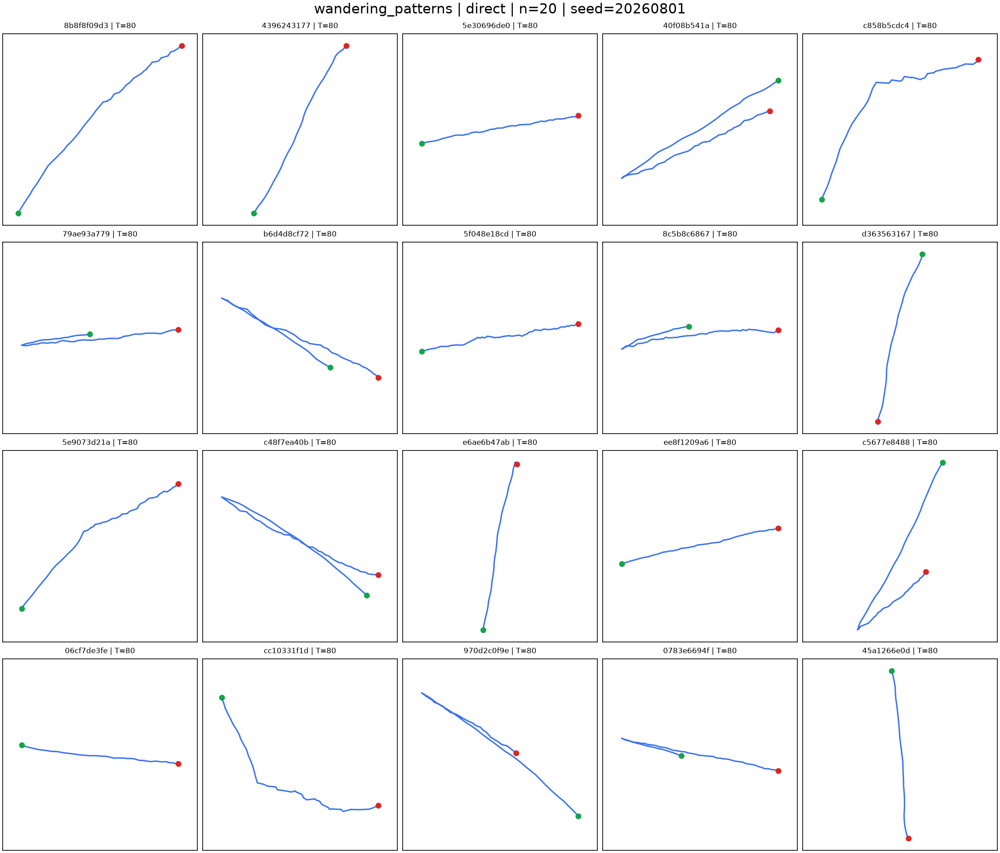
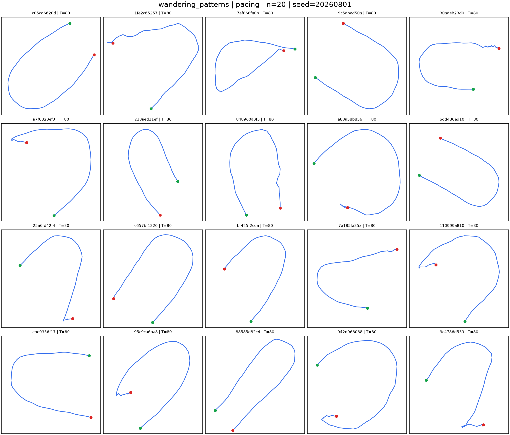
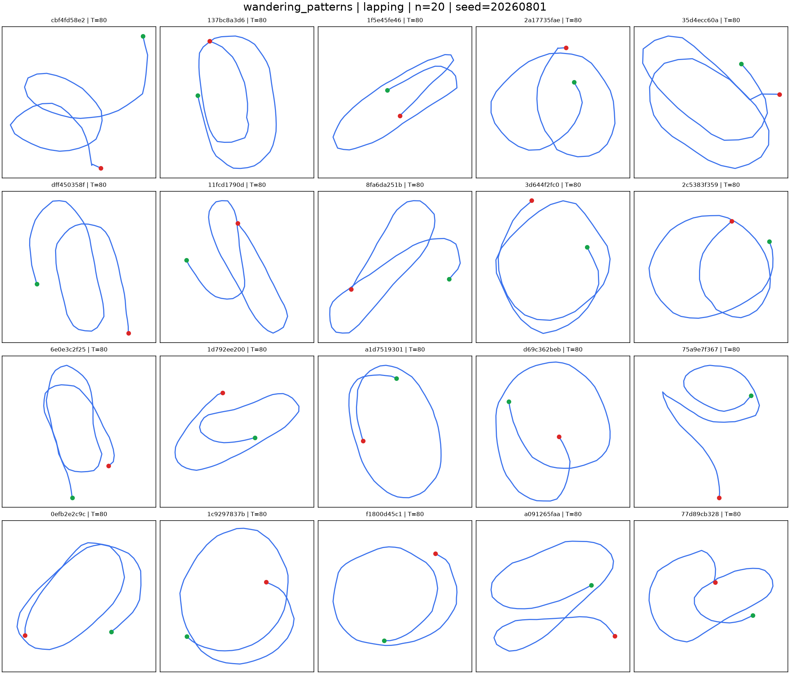
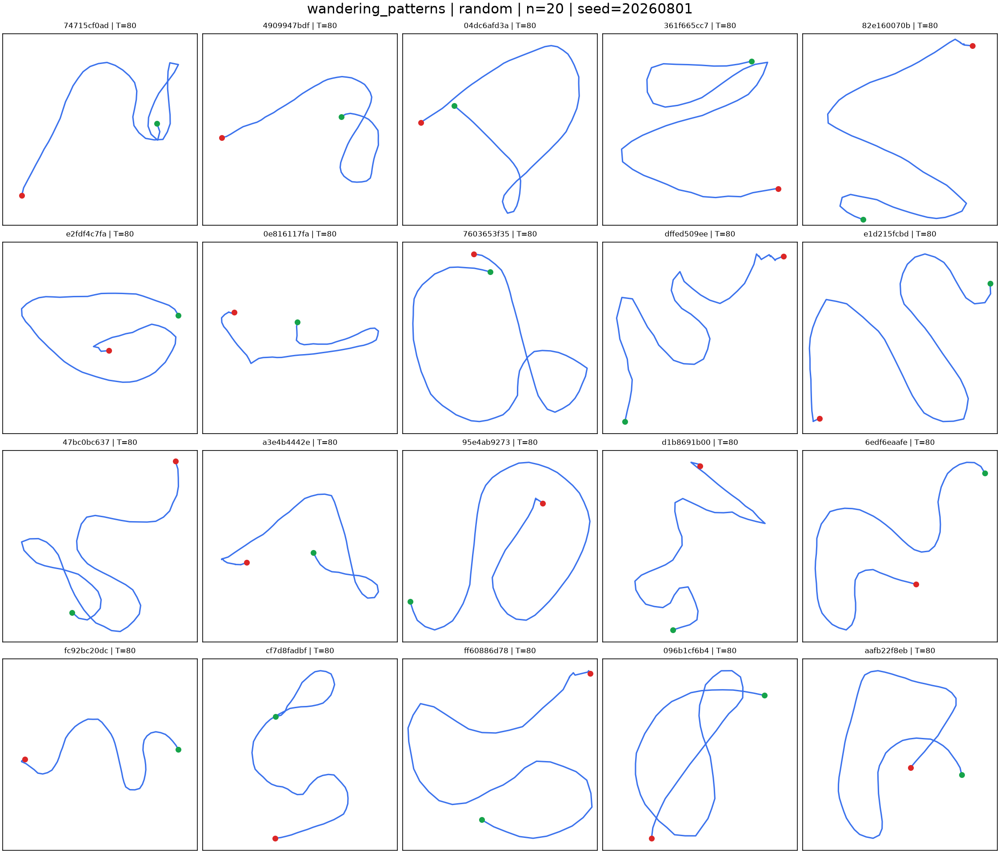

# Windows 本地部署 CVAT 徘徊识别视频标注教程

版本：v1.3｜更新时间：2026-08-16｜适用工具：与跌倒标注相同版本的本地 CVAT Community

本教程面向已经做过跌倒视频标注的同学。操作方式与跌倒标注相似，但标签含义不同：跌倒标注关注动作和事件，徘徊标注关注一段时间内实际走出的轨迹形态。

本教程默认当前批次视频、出镜和内部研发使用均已接受。标注员不重复审核隐私、授权、receipt 或文件 hash，只负责把原视频中的人物、episode 边界、shape、purpose 和可用性准确写入 CVAT。

当前五日快速交付中，B01+B02 均可反复用于 development，旧 holdout 身份不再限制调参。负责人后续提供的居家视频可以先跑 truth-free 自动链，再按失败案例补 CVAT；没有居家视频或尚未完成标注都不阻塞算法 core、日报、基线或 handoff。只有需要量化误差时才等待独立人工标签，标注仍不能根据模型预测改写。全部视频和标注默认已获内部研发授权，不增加合规审批步骤。现行任务见 [M0-CAM-5D 快速交付总任务书](../plans/M0-CAM-5D快速交付总任务书.md)。

## 1. 先记住六句话

```text
一个视频 = 一个 CVAT task
一个语义不变的行为时间段 = 一个 wandering_episode Rectangle Track
矩形框只用来指出“这段时间标的是画面中的谁”
先切完整 locomotion episode，再判断轨迹形态
CVAT XML 是人工标注来源，Markdown 复核队列不是标签文件
只按实际画面标注，不按拍摄计划或模型预测改标签
```

本项目的主要形态标签是：

```text
direct
pacing
lapping
random
unknown
```

口头说的 `lap` 在项目中的正式标签名是 `lapping`。不要在 CVAT 中新增 `lap`、`looping`、`mixed` 或其他同义标签。

标注时还要分开填写：

- 人物走出了什么轨迹形态；
- 人物为什么这样走；
- 判断目的的证据来自哪里；
- 这段画面是否清楚可用。

不要把“为什么这样走”混进轨迹形态。例如，打电话时来回走仍然是 `pacing`，同时填写 `purposeful`。

`wandering_like_positive` 只表示“徘徊样轨迹评价类别”，不是医学诊断，也不表示人物一定存在健康问题。

当前摄像头评估以 `direct` 对 `pacing/lapping/random` 的 shape-binary 为主要结果，四分类用于诊断 subtype 混淆。因此不能因为 pacing 和 random 容易被模型预测成 lapping 就修改人工标签；标注员仍必须按真实画面保留四类区别。

### 1.1 标注员最终产出什么

标注员最终交付：

```text
CVAT for video 1.1 导出 ZIP
  └─ annotations.xml
视频编号清单
无法判断、遮挡、出画或目标人物问题说明
```

后续 importer 才会把 XML 转换成 truth-free boundary 和独立 truth JSONL。标注员不手写 JSONL，不填写机器 `track_id`，也不需要把 CVAT 内容再抄到 Markdown 表格。

项目中的人工复核队列只用于记录：视频是否已分配、XML 是否已导出、import 是否成功、是否需要二次裁决。队列中即使存在“人工 boundary/shape/purpose”列，也不能代替 CVAT Track 和 XML。

### 1.2 第一遍标注可以看什么

第一遍人工标注可以看：

- 原始完整视频；
- 匿名 `video_id`；
- 本教程和拍摄手册；
- 为判断 purpose 所必需的真实拍摄任务说明，例如 phone call、carrying、exercise；
- 必要时在看完完整视频后查看 truth-free 轨迹图，辅助理解透视和遮挡。

第一遍不得看：

- 模型四分类或 binary 预测；
- 模型概率、失败清单或 confusion；
- AI preannotation；
- 以 `P01/L01/R01` 文件夹名作为形态答案。

拍摄脚本可以证明 purpose 或 `script_type`，但不能决定 `observable_pattern`。例如文件名写 pacing，实际形成闭环，仍应按 lapping 或实际画面标注。

## 2. 与跌倒 CVAT 标注的相同和不同

相同点：

- 都使用一个视频一个 task；
- 都使用 Rectangle Track 表示一个时间片段；
- 都需要开始帧、结束前最后一个非 outside keyframe 和下一帧 outside；
- 都需要保存、回看、自检并导出 `CVAT for video 1.1`；
- 矩形框都不是最终人体检测框真值。

不同点：

- 跌倒项目用 A、B、C、D、U 动作标签；
- 徘徊项目只创建一个 `wandering_episode` 标签；
- `direct / pacing / lapping / random / unknown` 在属性中选择；
- 一条较长视频可以包含多个彼此分开的 episode；
- 静坐、站立、入场和准备动作不需要硬贴轨迹标签；
- 未标注时间不能自动当成普通负例。

## 3. 已经能做跌倒标注时怎样开始

如果电脑上的本地 CVAT 已经能正常完成跌倒标注：

1. 继续使用同一个 CVAT；
2. 不需要重新安装 WSL、Docker 或 CVAT；
3. 不要在原跌倒项目中增加徘徊标签；
4. 新建独立的徘徊 Project；
5. 从本教程第 6 节开始操作。

同一批标注过程中不要自行更新 CVAT 版本，以免菜单、导出格式或属性行为发生变化。可以在 Ubuntu 中记录当前精确版本：

```bash
cd ~/cvat
git rev-parse HEAD
```

同一批新增电脑应使用这条已验证 commit；本教程不为团队虚构一个未经实测的版本号。

## 4. 第一次安装本地 CVAT

### 4.1 Windows 和软件准备

建议使用：

| 项目 | 建议 |
|---|---|
| 系统 | Windows 10 2004 及以上，或 Windows 11 |
| 内存 | 16 GB 及以上 |
| 磁盘 | 至少保留 50 GB 可用空间 |
| 浏览器 | 优先 Google Chrome |
| 组件 | WSL2、Ubuntu、Docker Desktop、Git |

如果跌倒标注电脑已有这些软件，不要重复安装。

### 4.2 安装和检查 WSL2

用管理员身份打开 PowerShell：

```powershell
wsl --install -d Ubuntu
```

安装完成并重启后检查：

```powershell
wsl -l -v
```

应看到 Ubuntu 的 `VERSION` 为 `2`。如果不是：

```powershell
wsl --set-version Ubuntu 2
wsl --set-default-version 2
```

### 4.3 Docker Desktop

安装 Docker Desktop for Windows 后：

1. 打开 Docker Desktop；
2. 进入 `Settings > Resources > WSL Integration`；
3. 启用当前 Ubuntu；
4. 点击 `Apply & Restart`。

在 Ubuntu 终端检查：

```bash
docker version
docker compose version
```

### 4.4 下载并启动 CVAT

以下命令在 Ubuntu 终端执行：

```bash
sudo apt update
sudo apt install -y git
cd ~
git clone https://github.com/cvat-ai/cvat
cd cvat
git checkout <从跌倒标注电脑记录的精确 commit>
git rev-parse HEAD
docker compose up -d
```

如果暂时拿不到已验证 commit，优先复用已经能完成跌倒标注的 CVAT，不要随意选择另一个版本开新批次。

第一次启动需要下载镜像，完成后检查：

```bash
docker ps
```

创建本地管理员账号：

```bash
docker exec -it cvat_server bash -ic 'python3 ~/manage.py createsuperuser'
```

然后用浏览器打开：

```text
http://localhost:8080
```

### 4.5 日常启动和关闭

启动：

```bash
cd ~/cvat
docker compose up -d
```

关闭：

```bash
cd ~/cvat
docker compose down
```

需要完全停止 WSL 时，在 PowerShell 执行：

```powershell
wsl --shutdown
```

查看服务日志：

```bash
cd ~/cvat
docker compose logs -f cvat_server
```

## 5. 准备视频

标注前检查：

- 视频能正常播放；
- 文件名与拍摄清单中的 `video_id` 对应；
- 不覆盖或改写原始视频；
- 一个文件只对应一个视频；
- 如果生成了 MP4 标注副本，要在清单中保留它与原视频的对应关系。

推荐文件名示例：

```text
VID-B01-0004_pacing-R01.mp4
VID-B01-0007_phone-call-R01.mp4
VID-B01-0008_natural-office-R01.mp4
```

第一批尽量保持一条视频中只有一个需要标注的目标人物。多人画面没有明确目标时，不要自行猜测。

## 6. 创建徘徊 CVAT Project

进入 CVAT：

1. 点击顶部 `Projects`；
2. 点击 `+`；
3. 选择 `Create new project`；
4. Project name 填写：

```text
wandering_episode_annotation_v1_B01
```

其中 `B01` 是当前拍摄批次，可以按实际批次修改。

Description 建议填写：

```text
徘徊轨迹 episode 标注。一个视频一个 task，一个语义不变的时间段一个 Rectangle Track。轨迹形态和行为目的分开填写，不使用模型预测修改标签。
```

### 6.1 导入标签配置

在 Project 的 Labels 中打开 `Raw`，粘贴以下完整 JSON：

```json
[
  {
    "name": "wandering_episode",
    "type": "rectangle",
    "attributes": [
      {
        "name": "observable_pattern",
        "input_type": "select",
        "mutable": false,
        "values": [
          "not_set",
          "direct",
          "pacing",
          "lapping",
          "random",
          "unknown"
        ],
        "default_value": "not_set"
      },
      {
        "name": "purpose_context",
        "input_type": "select",
        "mutable": false,
        "values": [
          "not_set",
          "purposeful",
          "nonpurposeful",
          "unknown"
        ],
        "default_value": "not_set"
      },
      {
        "name": "purpose_evidence",
        "input_type": "select",
        "mutable": false,
        "values": [
          "not_set",
          "scripted",
          "participant_report",
          "observed_context",
          "unknown"
        ],
        "default_value": "not_set"
      },
      {
        "name": "evaluation_role",
        "input_type": "select",
        "mutable": false,
        "values": [
          "not_set",
          "wandering_like_positive",
          "purposeful_hard_negative",
          "ordinary_negative",
          "uncertain",
          "excluded"
        ],
        "default_value": "not_set"
      },
      {
        "name": "script_type",
        "input_type": "select",
        "mutable": false,
        "values": [
          "not_set",
          "frame_check",
          "tracking_smoke",
          "shape_prompt",
          "natural_activity",
          "phone_call",
          "searching",
          "cleaning",
          "exercise",
          "carrying",
          "office_routine",
          "other"
        ],
        "default_value": "not_set"
      },
      {
        "name": "visibility_quality",
        "input_type": "select",
        "mutable": false,
        "values": [
          "not_set",
          "good",
          "partial",
          "poor"
        ],
        "default_value": "not_set"
      },
      {
        "name": "tracking_issue",
        "input_type": "select",
        "mutable": false,
        "values": [
          "not_checked",
          "none",
          "occlusion",
          "out_of_frame",
          "fragmented_track",
          "id_switch",
          "wrong_target",
          "multiple_issues"
        ],
        "default_value": "not_checked"
      },
      {
        "name": "note",
        "input_type": "text",
        "mutable": false,
        "values": [
          ""
        ],
        "default_value": ""
      }
    ]
  }
]
```

保存后应看到：

```text
1 个 rectangle label：wandering_episode
8 个 attributes
```

`not_set` 只是在 CVAT 中提醒“这个属性还没有人工确认”，不是正式标签。每条 track 完成时必须把所有 `not_set` 改成实际值；交付前仍有 `not_set` 就表示漏填。

如果名称、拼写或可选值不同，不要继续创建 task，先重新粘贴配置。

## 7. 批量创建 Task

基本原则：

```text
一个视频 = 一个 task
```

不要把多个视频合并到一个 task。

进入 `Tasks` 页面：

1. 点击右上角 `+`；
2. 选择 `Create multi tasks`；
3. Name 填：

```text
wandering__B01__{{file_name}}
```

4. Project 选择刚创建的徘徊 Project；
5. Labels 应自动继承，不要重新创建；
6. 在 `Select files > My computer` 中多选视频；
7. 检查提交按钮。

如果选择了 5 个视频，按钮应显示类似：

```text
Submit 5 tasks
```

如果多选了视频却显示 `Submit 1 task`，先停止并检查设置。

## 8. 标注一条视频的顺序

每条视频按四遍完成：

### 第一遍：只看完整视频

1. 从头到尾播放，不创建框、不暂停猜类别；
2. 确认目标人物；
3. 了解人物什么时候开始连续行走、什么时候停留、坐下、出画或改变任务；
4. 不看 AI preannotation 和模型预测。

### 第二遍：只确定 episode

1. 找到每次 locomotion bout；
2. 用“大约三步确认行走成立，再回退到第一帧”的方法找开始；
3. 用持续停留、活动切换、出画或 session end 找结束；
4. 暂时不因一次转身、折返或经过起点切段；
5. 先在时间轴上记下候选边界。

### 第三遍：判断 shape 与 purpose

1. 对每个完整候选 episode 单独回看；
2. 先判断 direct/pacing/lapping/random/unknown；
3. 再独立判断 purposeful/nonpurposeful/unknown 和证据；
4. shape 或 purpose 清楚改变时，把候选 episode 拆成两个 Track；
5. 不按文件名或拍摄计划修改 shape。

### 第四遍：建 Track、自检并保存

1. 创建 `wandering_episode` Rectangle Track；
2. 设置开始、结束前最后一个非 outside keyframe 和下一帧 outside；
3. 填写全部属性，清除所有 `not_set`；
4. 从头回看边界、漏标、重叠、人物身份和属性组合；
5. 使用 `Ctrl + S` 保存。

不要第一遍播放时边看边猜。pacing、lapping 和 random 都必须根据完整路径关系判断，单看某一帧、某一次转身或起终点位置都不够。

完成一条 track 后，检查属性中没有遗留 `not_set`。

标注前不要加载徘徊模型的预测结果。拍摄脚本只是目的证据之一，也不是形态真值。

### 8.1 和跌倒标注最直接的区别

可以像跌倒标注一样用矩形框住人，但徘徊不能只框“某个关键动作发生的一帧”。必须使用 Rectangle **Track** 跟住同一个人，并让这条 track 覆盖整个轨迹形态成立的时间段。

```text
不是：只在人物转身或折返的那一帧画一个框
而是：从该段轨迹开始成立，一直框到该段结束
```

矩形框的作用是确认“哪个人在什么时间段内形成了这条轨迹”，不是让标注员在地面上画轨迹线。轨迹形态通过整段视频判断，然后作为 `observable_pattern` 属性填在这条 track 上。

## 9. Rectangle Track 怎样画

每个语义不变的 episode 建一个独立 track：

1. 跳到 episode 的第一帧；
2. 选择 `wandering_episode`；
3. 选择 Rectangle 的 `Track` 模式，不是单帧 Shape；
4. 用矩形框住目标人物主要可见身体区域；
5. 播放或移动时间轴；
6. 人物位置或方向明显变化时，调整矩形形成新 keyframe；
7. 在 episode 最后一个属于本段的帧保留非 outside keyframe；
8. 在下一帧设置 `outside=true`；
9. 填写属性并保存。

在当前常用 CVAT 界面中，可以选中 track 后按 `K` 或点击星形按钮建立 keyframe，按 `O` 或点击 Outside 按钮切换 outside。若实际界面快捷键不同，以页面显示为准。

矩形框要求：

- 能看出标的是哪个人；
- 不要框到其他人；
- 不要求逐帧达到人体检测框精度；
- 不需要每一帧都手工调整；
- 当自动插值已经明显偏离人物时，再增加 keyframe；
- 轨迹形态、行为目的或可判性改变时，新建另一个 episode track。

不要使用孤立 Rectangle Shape 代替 Track。单帧 Shape 不能表达完整时间段。

## 10. Keyframe 与 outside

假设一个 pacing episode 从第 120 帧开始，第 420 帧是最后一帧，第 421 帧已经停止来回走。

正确结构：

```text
frame 120  outside=false  episode 开始
frame 420  outside=false  本段最后一帧
frame 421  outside=true   第一个不属于本段的帧
```

中间可按人物位置变化增加 keyframe：

```text
frame 120  keyframe，人物在左侧
frame 210  keyframe，人物在右侧
frame 300  keyframe，人物再次回到左侧
frame 420  keyframe，本段最后一帧
frame 421  outside=true
```

如果 episode 持续到视频最后一帧：

```text
开始帧       outside=false
视频最后一帧  outside=false，并保留 keyframe
```

CVAT 本身会在 keyframe 之间插值，开始帧 `outside=false`、第一个不属于 episode 的帧 `outside=true` 已能表达时间段。本项目仍建议在结束前最后一帧保留非 outside keyframe，方便检查结束边界和人物框位置；它不是要求逐帧精修人体框。

后续数据整理会把“第一个 outside 帧”换算成 `end_sec_exclusive`。标注员不需要手工计算秒数。

## 11. Episode 怎样切分

episode 是一次连续的 locomotion bout。它回答“这一次连续行走从哪里开始、到哪里结束”，不回答“模型要看多少秒”。一条 episode 可以只有几秒，也可以超过 40 秒；模型后续会对完整路径做空间弧长重采样，不要求人工凑固定长度。

### 11.1 开始

使用下面的回看方法：

1. 正向播放，直到人物已经连续迈出大约三步，确认这是一段持续行走，而不是挪脚、站位或单步取物；
2. 暂停并向前逐帧回退；
3. 找到这次连续行走真正启动的第一帧；
4. 将该帧设为 Track 的第一个 `outside=false` keyframe。

三步用于确认 locomotion 已成立，不是从第三步才开始标，也不是模型阈值。

- 入场和站位通常不算；
- 原地转身、调整脚步或只走一两步又停下通常不单独建 episode；
- 自然停留后重新开始持续走动，从新一段行走的第一帧判断；
- 对 pacing、lapping、random，应先看完整段，再回到第一段有效轨迹设置开始帧。

短 `EPISODE` 视频如果开头已经在走，Track 可以从视频第一帧开始，并在 note 说明 `episode starts before/at clip boundary`；不要伪造更早边界。

### 11.2 结束

以下任一情况出现时，在“第一个不再属于原 episode 的帧”设置 `outside=true`：

- 同一地点持续停留约 15 秒；
- 坐下或明确开始另一活动；
- 轨迹形态或行为目的发生清楚改变；
- 目标人物改变；
- track end、出画、长 gap 或 ID switch，无法继续判断；
- 画面进入无法可靠判断的过渡区间。

约 15 秒是人工标注锚点，不是当前 automatic boundary 的既定阈值。判断停留是否达到约 15 秒时，可以先粗看时间轴，再逐帧确定停止行走后的第一帧是否应作为 episode 外部；不要把 15 秒静止本身包含在 locomotion Track 中。

数秒停顿、犹豫、观察、转向、折返和闭环通常仍属于同一 locomotion episode，不在这些位置结束。如果短暂停顿后 purpose 已清楚改变，例如停止 pacing 后开始寻找文件，即使不足 15 秒，也应在活动改变处结束原 Track并建立新 Track。

视频结束是硬边界。若人物一直走到最后一帧，最后一帧保持 `outside=false`，不需要虚构 outside 帧；在 note 中说明 episode 到达 clip end。

### 11.3 相邻和重叠

- 同一个人的 episode 不能重叠；
- 前一个 episode 的 outside 帧可以同时是后一个 episode 的开始帧；
- 形态切换模糊时，缩短两边清楚区间，把中间标成 `uncertain`；
- 短暂自然停顿后仍明显延续同一形态时，可以保留为同一 episode；
- 目的已经改变时，即使形态相同，也要新建 track，因为属性已经变化。

若人物 A→B 后立即返回，期间没有可观察的持续停留或任务切换，不要为了得到两个 direct 强行切开。保留完整 episode，再按实际轨迹标 shape；目的单独填写。起终点接近只能作为形态证据之一，不能单独决定 lapping 或 wandering-like。

同一连续 episode 中发生的 pacing 端点反转、lapping 回到起点、random 改变方向，都不是新的 episode。它们是 shape 的内部结构。

### 11.4 什么时候因为 shape 或 purpose 切分

出现下面情况时建立新 Track：

- direct 到达目的地后，人物开始持续 pacing；
- pacing 停止后，人物围绕中心区域连续 lapping；
- 原本无任务的来回走动结束，人物拿起电话后继续有目的走动；
- 同一人物从普通行走转入清洁、搬运、寻找等明确活动；
- 画面中间有一段无法可靠判断，清楚区间应分开保存。

不要仅因为下面情况切分：

- pacing 在端点转身；
- lapping 完成一圈；
- random 每次改变方向；
- 路径穿过之前的位置；
- 模型旧流程使用 40 秒窗口。

### 11.5 五个常见边界例子

**例 1：短 direct 文件**

```text
00–03 秒  站定
03–09 秒  A→B
09–13 秒  站定，视频结束
```

只建立 `03–09 秒 direct`。不需要为了达到 15 秒把结束站立包含进 episode。

**例 2：pacing 中短暂停顿**

```text
05–20 秒  A↔B
20–25 秒  在 B 端停 5 秒
25–42 秒  继续同一 A↔B
```

如果任务和形态未改变，建立一个 `05–42 秒 pacing`，不在 20/25 秒切开。

**例 3：持续停留后重新开始**

```text
08–30 秒  pacing
30–47 秒  同地停留
47–65 秒  direct 去门口
```

建立两个 Track：`08–30 pacing` 和 `47–65 direct`。

**例 4：purpose 改变但 shape 相同**

```text
10–28 秒  无任务 pacing
28–31 秒  接起电话
31–55 秒  通话 pacing
```

建立两个 pacing Track。前者可为 `nonpurposeful`，后者为 `purposeful`；不要合成一个 purpose 不一致的 Track。

**例 5：出画后重新进入**

```text
06–24 秒  random，随后出画
24–33 秒  人物不可见
33–52 秒  重新进入后继续走动
```

24 秒结束第一条。33 秒重新判断新的 episode、人物和 shape，不跨出画区间连接。

不要按模型使用的固定窗口长度切段。人工标注单位是实际 episode，不是重复的 40 秒窗口。

这里要区分 episode-first 主路线和 legacy 40 秒诊断：

- 几秒钟但开始、结束和形态清楚的 direct，是有效 episode，应正常标注；
- episode-first 路线会把这条完整路径按空间弧长重采样为 80 点，单个几秒 episode 可以独立做 shape 推理；
- 现有正式 40 秒 camera wrapper 暂时保留为 legacy long-context diagnostic，它不是标注单位，也不覆盖 episode 真值；
- 多个短文件的总时长不能相加成一个模型窗口，也不要把它们剪接成假连续轨迹；
- 不要把短 direct 拉长到 40 秒，也不要因为模型预测修改标签。

## 12. `observable_pattern` 怎样选

### 12.1 图片来源必须先看

下面四张联系表来自本项目实际使用的 WanderingPatterns 数据集，不是人为画出的理想轨迹。原始文件位于：

```text
D:\徘徊数据集\徘徊模块数据集\WanderingPatterns-四类轨迹\raw\patterns_dataset.pkl
```

原始文件包含 `direct / pacing / lapping / random` 各 400 条轨迹。每张联系表按固定随机种子抽取该标签的 20 条真实轨迹，每条轨迹为 80 个时序点：蓝线是按时间顺序连接的轨迹，绿点是起点，红点是终点。详细来源和文件哈希见[真实数据集轨迹图片来源说明](轨迹标签示意图/真实数据集轨迹图片来源说明.md)。

这些是 IMU 与行人航位推算得到的二维轨迹，不是摄像头画面。它们用于说明模型数据里每个标签实际包含怎样的形态变化，不能要求拍摄者严格照其中一条线走。

### 12.2 四类真实数据轨迹

#### `direct`：整体从一个位置向另一个位置推进



真实样本多数整体向一个方向推进。路线可以弯曲，也可能局部贴近或短暂回头；重点是没有形成明显的外出后返回、稳定闭环或持续不规则游走。

#### `pacing`：明显折返或外出后返回



该数据集里的 pacing 经常呈宽 U 形、发夹形或近闭合的“出去再返回”路线。一个 80 点窗口有时只完整包含一次较大的折返，不一定出现很多轮完全相同的来回。

#### `lapping`：形成明显闭环或重复环绕



真实样本常见圆形、椭圆形、重叠环或类似 8 字的路线。闭环不要求规则，也不要求起点和终点完全重合；重点是轨迹明显绕回先前区域。

#### `random`：多次不规则改变方向



真实样本常包含多个不规则转向、局部小环和不同尺度的弯曲，但整体没有清楚的单一折返主轴，也没有稳定重复的环绕模式。

### 12.3 为什么没有 `unknown` 轨迹图

`D:\徘徊数据集` 中的 WanderingPatterns 只有上述四类，没有 `unknown` 样本。摄像头标注里的 `unknown` 表示画面不足、轨迹缺失、过渡混合或边界无法可靠判断，不是一种真实走法，因此不能人为画一条路线冒充数据集样本。

清楚可见的不规则轨迹应标 `random`；只有证据不足时才标 `unknown`。

### 12.4 文字判断表

| 值 | 画面含义 | 不要这样标 |
|---|---|---|
| `direct` | 整体从一个位置向另一个位置推进；可以有正常弯曲或局部短回头 | 不要要求一定是尺子画出的直线 |
| `pacing` | 出去后明显折返或沿近似主轴返回；实际数据常见宽 U 形、发夹形和近闭合返回 | 只有普通转弯、整体仍持续向前时不要标 pacing |
| `lapping` | 形成明显闭合或近闭合环路，常见圆环、椭圆环、重叠环或类似 8 字 | 只有一次 U 形折返而没有环绕时不要标 lapping |
| `random` | 持续多次不规则改变方向，没有清楚的折返主轴或稳定环绕模式 | “看不懂”不能直接等于 random |
| `unknown` | 画面不足、过渡混合或边界不清，无法可靠选择四类之一 | 不要为了凑类别猜 direct/pacing/lapping/random |

边界判断要点：

- pacing 看“明显折返或出去后返回”，不要求同一片段内出现很多轮，也不要求两条线完全重合；
- lapping 看“轨迹形成环并绕回先前区域”，不要求路线是标准圆；
- random 看“持续多方向不规则”，不是随便走几步；
- 计划拍什么不等于实际标签；
- 速度快慢、是否停顿、动作是否有目的，都不能单独决定形态。

### 12.5 摄像头画面中的判定顺序

对一个边界已经确定的完整 episode，按下面顺序判断：

1. **是否整体从一个区域推进到另一个区域，并且没有显著返回或重复？** 是则优先 `direct`。
2. **是否存在一条稳定主轴、相似的两个端点，并沿该轴发生方向反转？** 是则优先 `pacing`。
3. **是否围绕一个相对稳定的中心，连续经过不同侧面并重复回到起始区域？** 是则优先 `lapping`。
4. **是否持续访问多个分散区域、多次改变方向，但既没有稳定主轴也没有重复环路？** 是则优先 `random`。
5. 四个问题都不能稳定回答，或画面/边界不足，则使用 `unknown + uncertain`。

不要先问“起点和终点近不近”。起终点接近可以出现在 pacing、lapping、random，甚至一条弯曲 direct 中，不能单独决定类别。

### 12.6 pacing、lapping、random 的关键区别

| 观察关系 | pacing | lapping | random |
|---|---|---|---|
| 主要空间结构 | 一条主轴或窄带 | 一个被轨迹包围的中心区域 | 多个分散区域 |
| 时间顺序 | 到端点后反向返回 | 沿环路继续前进，重复经过不同侧面 | 访问顺序不规则、非周期 |
| 路径复用 | 往程和返程大量复用同一路径 | 每圈复用同一环路或近似环路 | 局部可复用，但无稳定轴/环 |
| 典型方向变化 | 约 180° 反转 | 连续转弯，方向逐渐绕回 | 不同大小和方向的多次转向 |
| 是否有稳定中心 | 通常没有 | 有 | 没有或不断变化 |
| 是否有稳定两端 | 有 | 通常没有 | 没有 |

#### pacing 与 lapping

摄像头透视最容易让这两类混淆。不要只看轨迹线最后是否闭合，要看人物怎样经过场景：

- 人物到左端后转身，沿刚才的通道返回右端，这是 pacing；
- 人物经过近侧、右侧、远侧、左侧后回到原区域，并继续相同绕行，这是 lapping；
- pacing 的宽 U 形可能让起终点靠近，但如果核心关系仍是“出去后沿主轴返回”，仍标 pacing；
- lapping 被透视压扁后可能像往返线，但如果人物确实连续经过中心区域的不同侧面并重复环绕，仍标 lapping；
- 只有一次 U 形折返，没有完整环绕，不要标 lapping。

#### random 与 lapping

- lapping 通常重复相似的区域顺序，例如近侧→右侧→远侧→左侧→近侧；
- random 的区域访问顺序不稳定，转向尺度和方向变化，不能指出重复的圈；
- random 可以回访某个位置或出现局部小环，但不能持续围绕同一中心；
- 人物一直沿房间外圈走，即使每圈不完全一样，通常仍更接近 lapping；
- 找东西时走出不规则路线，shape 可以是 random，但 purpose 另填 purposeful。

#### random 与 tracking 错误

检测框抖动、轨迹断裂、ID switch 或错跟其他人都不是 random 的行为证据。先看原视频中的真实人物移动：

- 人物实际沿单一路线前进，但 truth-free 轨迹图抖动，shape 仍按原视频判断；
- 人物身份中途不确定，使用 `wrong_target/uncertain/excluded`，不要把混乱轨迹标 random；
- 只有在人物真实持续多方向移动时才标 random。

### 12.7 truth-free 轨迹图怎样使用

truth-free 轨迹图只显示 detector/tracker 输出的时间顺序、起点和终点，不包含人工标签或模型分类。使用顺序固定为：

1. 先看完整原视频并形成初步判断；
2. 再看轨迹图，检查透视、路径重叠和 tracking 断裂；
3. 轨迹图与视频冲突时，以可观察原视频为主，并在 `tracking_issue/note` 记录问题；
4. 不得查看带 AI preannotation、预测类别或概率的页面来决定标签。

轨迹图可以帮助确认“是否有主轴、是否包围区域、是否访问多个区域”，但不能代替 episode 边界和人工观看。

## 13. Purpose 与证据怎样填

### 13.1 `purpose_context`

```text
purposeful     有明确活动目的
nonpurposeful  脚本或人物说明明确没有任务目的
unknown        没有足够证据判断目的
```

### 13.2 `purpose_evidence`

```text
scripted            拍摄清单或动作脚本明确说明目的
participant_report  人物在拍后明确说明自己的目的
observed_context    画面直接显示出取物、清洁、通话等目的
unknown             没有可靠目的证据
```

必须遵守：

- `purpose_context=unknown` 时，`purpose_evidence` 也必须是 `unknown`；
- 填写 purposeful 或 nonpurposeful 时，evidence 不能是 unknown；
- 不能根据轨迹形状猜目的；
- 画面里“没看到任务”不等于 nonpurposeful；
- 打电话来回走仍标 `pacing + purposeful`；
- 找东西时不规则走动仍标 `random + purposeful`。

## 14. `evaluation_role` 怎样选

| 实际组合 | evaluation_role |
|---|---|
| `direct`，且 purpose/evidence 也可判 | `ordinary_negative` |
| `pacing/lapping/random + nonpurposeful` | `wandering_like_positive` |
| `pacing/lapping/random + purposeful` | `purposeful_hard_negative` |
| shape 或 purpose 缺少可靠证据 | `uncertain` |
| 错人、整段不可用或无法形成可靠真值 | `excluded` |

特别注意：

- `purposeful_hard_negative` 不能与 direct 组合；
- purposeful pacing 不能为了变成负例而改写为 direct；
- 不创建 `purposeful_pacing`、`mixed` 等新形态；
- `observable_pattern=unknown` 时只能使用 `uncertain` 或 `excluded`；
- `uncertain` 和 `excluded` 必须在 note 中写原因。

选择优先级：只要 purpose/evidence 仍是 unknown，evaluation role 就选 `uncertain`；不要因为 shape 是清楚的 direct 就覆盖这条规则。这里的 uncertain 表示 purpose/告警用途仍不确定，不会自动抹掉已经清楚填写的 shape；EP1B 的 shape-only evaluator 会单独判断形态是否可评分，仍不会修改你的原标签。

正式整理时，`annotation_status` 会按 role 确定：

```text
uncertain  -> uncertain
excluded   -> excluded
其他三类   -> accepted
```

标注员不需要在 CVAT 中重复填写 `annotation_status`。

## 15. 其他属性怎样填

### 15.1 `script_type`

从拍摄清单或文件名选择，不根据最后走出的形态反推：

| 值 | 使用情况 |
|---|---|
| `frame_check` | 取景检查 |
| `tracking_smoke` | 工程样片 |
| `shape_prompt` | 只给出轨迹形态提示 |
| `natural_activity` | 连续自然活动 |
| `phone_call` | 通话走动 |
| `searching` | 寻找物品 |
| `cleaning` | 清洁或整理 |
| `exercise` | 步行式锻炼 |
| `carrying` | 重复搬运 |
| `office_routine` | 普通办公室活动 |
| `other` | 其他；必须在 note 中说明 |

`script_type` 只描述拍摄方式，不是真值。即使 script_type 是 `shape_prompt`，shape 仍按实际画面填写。

### 15.2 `visibility_quality`

| 值 | 选择条件 |
|---|---|
| `good` | 人物和主要轨迹清楚，边界容易判断 |
| `partial` | 有局部遮挡、轻度模糊或短暂出画，但主要形态仍可判断 |
| `poor` | 关键轨迹长期不可见，通常只能 uncertain 或 excluded |

### 15.3 `tracking_issue`

如果只看原始视频、没有查看机器 tracking 结果，保留默认值：

```text
not_checked
```

只有实际看到对应问题时才选择：

```text
none
occlusion
out_of_frame
fragmented_track
id_switch
wrong_target
multiple_issues
```

不要根据“看起来可能难跟踪”猜 `fragmented_track` 或 `id_switch`。原始视频里的遮挡和出画可以选择对应值；算法碎片和换 ID 只有看到 tracking 结果才能填写。

### 15.4 `note`

以下情况必须填写 note：

- `evaluation_role=uncertain`；
- `evaluation_role=excluded`；
- `script_type=other`；
- 形态边界有明显争议；
- 遮挡、出画、多人交叉或目标不清；
- 需要说明实际形态与拍摄计划不一致。

示例：

```text
计划拍 random，实际 18-42 秒形成稳定来回，按 pacing 标注。
人物在转角处被遮挡，62-68 秒无法判断，单独标 uncertain。
画面出现两人，无法确认后半段是否仍是目标人物，标 excluded。
```

## 16. 哪些时间不标、哪些时间必须显式标

通常不创建 episode 的时间：

- 入场、站位和准备；
- 静坐、站立和原地停留；
- 结束后的离场；
- 与轨迹形态无关的短暂动作。

这些时间没有标签，不代表 ordinary negative。

需要显式创建 track 的时间：

- 清楚的 direct、pacing、lapping 或 random episode；
- 需要保留的形态不确定区间；
- 重要但完全不可用、需要排除的区间；
- 连续自然活动中可作为普通负例的清楚 direct 段。

不能把整条视频剩余未标注时间自动当成 negative，也不能因为视频文件名写了 pacing 就把整条视频全部标成 pacing。

## 17. 常见组合示例

| 实际画面 | pattern | purpose | evidence | role |
|---|---|---|---|---|
| 从座位直接走到门口 | direct | purposeful | observed_context | ordinary_negative |
| 脚本明确要求无任务地自然来回走 | pacing | nonpurposeful | scripted | wandering_like_positive |
| 打电话时持续来回走 | pacing | purposeful | scripted 或 observed_context | purposeful_hard_negative |
| 无任务地反复绕行 | lapping | nonpurposeful | scripted | wandering_like_positive |
| 围绕区域反复清洁 | lapping | purposeful | observed_context | purposeful_hard_negative |
| 找物品时多方向不规则走动 | random | purposeful | observed_context | purposeful_hard_negative |
| 轨迹清楚，但不知道人物为什么这样走 | 按实际 shape | unknown | unknown | uncertain |
| 形态混合且过渡边界不清 | unknown | unknown | unknown | uncertain |
| 人物长期出画或目标人物无法确认 | unknown | unknown | unknown | excluded |

## 18. 一条 90 秒视频的完整示例

假设实际画面是：

```text
00-08 秒   入场并站定
08-44 秒   无任务地持续来回走
44-62 秒   同地停留
62-82 秒   一边找物品一边多方向走动
82-90 秒   站定并离场
```

创建两个 Rectangle Track：

### Track 1

```text
时间：08-44 秒
observable_pattern=pacing
purpose_context=nonpurposeful
purpose_evidence=scripted
evaluation_role=wandering_like_positive
script_type=shape_prompt
visibility_quality=good
tracking_issue=not_checked
```

### Track 2

```text
时间：62-82 秒
observable_pattern=random
purpose_context=purposeful
purpose_evidence=observed_context
evaluation_role=purposeful_hard_negative
script_type=searching
visibility_quality=good
tracking_issue=not_checked
```

00-08、44-62 和 82-90 秒不需要硬贴四类轨迹标签。

## 19. 遮挡、出画和多人怎样处理

### 短暂遮挡，但仍能判断

- 可以保留原 episode；
- `visibility_quality=partial`；
- `tracking_issue=occlusion`；
- 必要时在 note 写明区间。

### 遮挡后无法判断形态

- 在遮挡开始前结束原 track；
- 模糊区间单独使用 `unknown + uncertain`；
- 恢复可见后重新建立新的 episode。

### 人物出画

- 不要把 track 延长到看不见的时间；
- 需要记录时使用 `out_of_frame`；
- 回到画面后重新判断形态，不自动继承出画前标签。

### 多人

- 只标任务指定的目标人物；
- 矩形框始终对应同一个人；
- 无法确认目标时使用 `uncertain` 或 `excluded`；
- 不要把 CVAT 自动生成的对象编号当成项目 tracking 的 `track_id`。

## 20. 保存和自检

标注过程中经常保存：

```text
Ctrl + S
```

每条视频完成后检查：

- [ ] 一个视频只对应一个 task；
- [ ] 每个语义不变的 episode 都是独立 Rectangle Track；
- [ ] 同一个人的 episode 没有时间重叠；
- [ ] 每条 track 有开始 keyframe；
- [ ] 按本项目约定，结束前最后一帧保留了便于检查的非 outside keyframe；
- [ ] 下一帧正确设置 outside；
- [ ] 所有属性都已主动确认，没有遗留 `not_set`；
- [ ] pattern 按实际画面填写，不是按文件名或脚本填写；
- [ ] pacing 有稳定主轴/端点，lapping 有重复环路，random 有多区域非周期关系；
- [ ] purpose 与 evidence 配套；
- [ ] purposeful pacing/lapping/random 没有被改成 direct；
- [ ] unknown 没有被当作 accepted 正负样本；
- [ ] uncertain、excluded 和 other 都有 note；
- [ ] 没有把未标注时间自动当 negative；
- [ ] 没有在人工标注完成前查看 AI preannotation、模型预测、概率或失败清单；
- [ ] 没有把 Markdown 复核队列当作标签来源；
- [ ] 没有参考模型预测回改标签；
- [ ] 已保存。

## 21. 导出标注

在 Task 或 Project 的 `Actions` 中：

1. 选择 `Export task dataset`、`Export dataset` 或当前版本中的 `Export annotations`；
2. 格式选择：

```text
CVAT for video 1.1
```

3. 不需要包含图片帧；
4. 保存 ZIP；
5. 不覆盖上一次导出。

推荐命名：

```text
wandering_cvat__B01__20260814.zip
```

不要使用 COCO、YOLO 或只保留单帧框的格式代替本项目导出，因为这些格式可能丢失视频 track、outside 或自定义属性。

## 22. 完成后交付什么

一批标注完成后交付：

```text
CVAT for video 1.1 导出 ZIP
本批视频编号清单
对应拍摄记录或 script_type 清单
无法判断、出画、遮挡和多人问题说明
```

示例问题说明：

```text
VID-B01-0007，frame 620-705，人物被遮挡，已单独标 unknown/uncertain。
VID-B01-0012，frame 940 后无法确认目标人物，已标 excluded。
```

## 23. CVAT 导出与正式数据的关系

CVAT ZIP 是人工 episode 标注来源，不是已经完成的模型输入。标注员只负责画面中的 episode、轨迹形态、行为目的和质量属性，不需要填写机器 tracking ID、session、机位、时钟或秒数，也不要猜这些字段。

拍摄记录、文件名、人工复核队列、AI preannotation 和预测输出都不能替代 XML。标注完成状态应以“对应视频的 CVAT task 已保存并成功导出 `annotations.xml`”为准，而不是以 Markdown 表格是否填满为准。

后续数据整理会：

- 读取 CVAT track 的开始帧、最后可见帧和 outside；
- 使用视频真实时间戳换算秒数；
- 与机器 tracking 唯一对应；
- 补齐视频、人物、session、机位和时钟字段；
- 根据 `evaluation_role` 确定 `annotation_status`；
- 生成 truth-free boundary JSONL 与独立 truth JSONL，再由模型只读取 boundary 文件。

CVAT 中的 `note` 用于说明不确定、排除和质量问题。EP1A importer 会把它保留在 `episode_truth.jsonl` 供复核；`episode_boundaries.jsonl` 和模型推理都不包含或读取 note。

当前仓库已经提供正式 EP1A importer。先从 CVAT ZIP 解压出 `annotations.xml`，并由数据整理同学确认机器 tracking 的 `target_track_id`，再在仓库根目录执行：

```bash
conda run -n eldercare-ai python scripts/wandering/import_wandering_cvat_episodes.py \
  --cvat-xml /path/to/annotations.xml \
  --media-sidecar /path/to/media_sidecar.json \
  --target-track-id 1 \
  --output-dir /path/to/new_import_output
```

输出为：

```text
episode_boundaries.jsonl   模型可读，不含 shape/purpose 真值
episode_truth.jsonl        评估使用，保留 shape/purpose/quality/note
import_summary.json
```

输出目录必须是全新目录。工具仍不直接读取 ZIP，也不会自动猜机器 Track ID；CVAT track ID 和 `target_track_id` 是不同编号，不能互换。

## 24. 常见问题

### 24.1 打不开 localhost:8080

检查 Docker Desktop，再在 Ubuntu 中执行：

```bash
cd ~/cvat
docker ps
docker compose up -d
```

仍打不开时：

```bash
docker compose logs -f cvat_server
```

### 24.2 上传后不能预览

- 保留原视频；
- 记录文件名；
- 生成兼容的 MP4 标注副本；
- 在视频清单中保留原视频与副本的对应关系；
- 不要用录屏文件替代原视频。

### 24.3 导出后边界或人物框位置不清楚

检查 track 是否包含开始帧、第一个 outside 帧，并建议补充结束前最后一个非 outside keyframe：

```text
开始帧            outside=false
结束前最后一帧     outside=false
下一帧            outside=true
```

### 24.4 属性无法修改

本配置的属性是 track 级固定属性。若中途形态、目的或可判性变化，应结束当前 track 并创建新 track，不要试图让同一 episode 中途换标签。

### 24.5 不知道是 pacing、lapping 还是 random

先完整回看：

- 稳定反复折返优先 pacing；
- 重复闭合或近闭合绕行优先 lapping；
- 持续多方向、无稳定往返轴和闭环时选 random；
- 仍无法可靠判断时选 unknown，并用 uncertain，不要猜。

## 25. 一页执行清单

```text
1. 启动 Docker 和 CVAT
2. 打开独立 wandering Project
3. 确认只有 wandering_episode 标签及 8 个属性
4. 确认一个视频一个 task
5. 确认未加载 AI preannotation 或模型预测
6. 第一遍完整观看并确认目标人物
7. 第二遍只确定完整 episode 边界
8. 第三遍按主轴/闭环/多区域关系判断 shape，再独立判断 purpose
9. 第四遍创建 Rectangle Track
10. 设置开始 keyframe、最后可见 keyframe、下一帧 outside
11. 填 pattern、purpose、evidence、role、script、quality、tracking、note，清除所有 not_set
12. 从头回看并完成自检
13. Ctrl+S 保存
14. 导出 CVAT for video 1.1 ZIP
15. 连同视频清单、拍摄记录和问题说明一起交付
```

## 26. 参考资料

- [本项目萤石 C6C 办公室视频拍摄与标注手册](萤石C6C办公室视频拍摄与标注手册.md)
- [本项目徘徊识别技术文档2](../plans/徘徊识别技术文档2.md)
- [跌倒模块 Windows 本地部署 CVAT 标注员教程](../../fall_risk/data/Windows本地部署CVAT标注员教程.md)
- [CVAT 官方安装指南](https://docs.cvat.ai/docs/administration/basics/installation/)
- [CVAT 官方 Track mode 说明](https://docs.cvat.ai/docs/annotation/manual-annotation/modes/track-mode-basics/)
- [CVAT 官方导出说明](https://docs.cvat.ai/docs/dataset_management/export-datasets/)
- [CVAT 官方原生格式说明](https://docs.cvat.ai/docs/manual/advanced/formats/format-cvat/)
